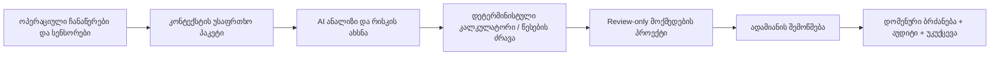

# VinOS AI პროცესებში ინტეგრაციის გეგმა

თარიღი: 2026-07-26
სტატუსი: აქტიური გეგმა

## მიზანი

AI აღარ უნდა იყოს მხოლოდ ცალკე ჩატის ფანჯარა. ის უნდა გახდეს თითოეული სამუშაო პროცესის კონტექსტური გადაწყვეტილების ფენა: ხედავდეს მიმდინარე ეკრანსა და შესაბამის ჩანაწერებს, წინასწარ ამოიცნობდეს რისკს, გამოთვლას ასრულებდეს დეტერმინისტული კალკულატორით და ადამიანს სთავაზობდეს შემოწმებად სამუშაო პროექტს.

AI-ის მიერ ოფიციალური ჩანაწერის, ქიმიური დოზის, გადატანის, ჩამოსხმის, შესხურების, შეკვეთის ან დოკუმენტის ავტომატურად შესრულება ამ ეტაპზე დაუშვებელია. ყველა ასეთი შედეგი რჩება `reviewOnly` პროექტად და მოქმედებად ქცევა ხდება შესაბამისი დომენური ბრძანებისა და ადამიანის დადასტურების შემდეგ.

## უკვე დამატებული საფუძველი

- AI მოთხოვნა სერვერს გადასცემს მიმდინარე მოდულსა და ეკრანს, ამიტომ პასუხი კონკრეტულ სამუშაო პროცესს ერგება.
- გადატანას, ჩამოსხმას, ინვენტარს, დუღილის კვებასა და მჟავიანობის კორექციას საკუთარი სწრაფი კითხვები აქვს.
- AI-ს პასუხიდან იქმნება სპეციალიზებული, მხოლოდ განსახილველი პროექტები:
  - ღვინის გადატანის გეგმა;
  - ჩამოსხმის მზადყოფნის შემოწმება;
  - მარაგის შევსების გეგმა;
  - YAN-ზე დაფუძნებული დუღილის კვების გეგმა;
  - მჟავიანობის კორექციის გეგმა.
- ყველა პროექტი შეიცავს აუცილებელ შესაყვან მონაცემებსა და უსაფრთხოების გაფრთხილებებს; AI ოფიციალურ ჩანაწერს თვითონ არ ცვლის.

## სამიზნე გამოცდილება

AI-მ ყოველთვის უნდა აჩვენოს:

1. რა დაინახა;
2. რა აკლია;
3. რას ასკვნის და რა სანდოობით;
4. რომელი გამოთვლა ან წესი გამოიყენა;
5. რას სთავაზობს ადამიანს;
6. რომელი ჩანაწერი შეიცვლება მხოლოდ დადასტურების შემდეგ.

## 90-დღიანი მიწოდების გეგმა

### ფაზა 1 — პროცესული Copilot, 1–2 კვირა

- თითოეულ ეკრანს ჰქონდეს ტიპიზებული კონტექსტის პაკეტი და არა მთელი ორგანიზაციის დაუფილტრავი მონაცემები.
- AI პასუხში შიდა წყაროების მითითება: პარტია, ჭურჭელი, ლაბორატორიული შედეგი, ინვენტარის პროდუქტი და ჩანაწერის თარიღი.
- პროექტიდან შესაბამის ფორმაზე ღრმა ბმული და წინასწარ შევსებული, მაგრამ ჯერ დაუდასტურებელი ველები.
- კალკულატორის შედეგი დარჩეს კოდის მიერ გამოთვლილი; AI მხოლოდ განმარტავს შეყვანილ მონაცემებს, რისკსა და ალტერნატივებს.
- არასრული ან მოძველებული მონაცემების მკაფიო დაბლოკვა.

### ფაზა 2 — პროაქტიული რისკები, 3–6 კვირა

- დუღილის მრუდის შენელების აღმოჩენა სიმკვრივის, ტემპერატურისა და დროის მიხედვით.
- SO₂/VA/pH ხელახალი შემოწმების ვადის შეთავაზება ბოლო ლაბორატორიული შედეგიდან და მარნის ეტაპიდან.
- ჭურჭლის თავისუფალი სივრცის, ტემპერატურისა და სანიტარიული სტატუსის რისკები.
- გადატანის „საიდან/სად“ თავსებადობის ახსნა მოცულობის, პარტიისა და ბოლო ოპერაციების მიხედვით.
- ჩამოსხმის ხარისხის კარიბჭე: ლაბორატორია, სტაბილურობა, ფილტრაცია, შეფუთვის კატეგორიები, მარაგი და საწყობი.
- ინვენტარის დეფიციტის პროგნოზი დაგეგმილი ოპერაციებისა და მიწოდების დროის მიხედვით.
- შეტყობინება ან WhatsApp შეხსენება მხოლოდ ადამიანის მიერ დამტკიცებული დავალებიდან.

### ფაზა 3 — სცენარები და დაგეგმვა, 7–10 კვირა

- „რა მოხდება თუ“ სიმულაცია: კუპაჟი, SO₂, მჟავიანობა, YAN კვება, ჩამოსხმის ფორმატები და მარაგის მოხმარება.
- ერთ რეკომენდაციასთან ერთად მინიმუმ ორი ალტერნატივა, მოსალოდნელი შედეგი და რისკი.
- რთველისა და მარნის დღიური გეგმის გენერირება სიმძლავრის, პერსონალისა და პრიორიტეტების მიხედვით.
- გაჩერებული დუღილის აღდგენის გამართული გზამკვლევი, რომელიც ჯერ მოითხოვს დიაგნოსტიკურ მონაცემებს და შემდეგ ქმნის ეტაპობრივ სამუშაო პროექტს.

### ფაზა 4 — მართვა და გაზომვა, 11–12 კვირა

- AI პროექტის სრული აუდიტი: მოდელი, კონტექსტის ვერსია, პასუხი, ადამიანის ცვლილება, საბოლოო გადაწყვეტილება და შედეგი.
- როლებზე დაფუძნებული წვდომა პროცესისა და მონაცემის დონეზე.
- ორგანიზაციისთვის AI ფუნქციის გამორთვა ან მხოლოდ წაკითხვაზე დატოვება.
- ყოველთვიური ხარისხის შეფასება რეალური, ანონიმიზებული შემთხვევებით.

## პროცესების პრიორიტეტული მატრიცა

| პროცესი | AI-ის ფუნქცია | უსაფრთხო შედეგი | პირველი საზომი |
|---|---|---|---|
| დუღილი | შენელების აღმოჩენა, YAN გეგმა, ტემპერატურის რისკი | სამუშაო/კვების პროექტი | რამდენად ადრე აღმოაჩინა რისკი |
| ლაბორატორია | შედეგების ახსნა, ხელახალი ანალიზის საჭიროება | ლაბორატორიული შემოწმების პროექტი | გამოტოვებული შემოწმებების შემცირება |
| გადატანა | საიდან/სად თავსებადობა, მოცულობა, დანაკარგი, სანიტარია | გადატანის პროექტი | დაბლოკილი არასწორი გადატანები |
| ჩამოსხმა | მზადყოფნა, შეფუთვა, მარაგი, საწყობი | ჩამოსხმის checklist | ბოლო წუთის დეფიციტების შემცირება |
| ინვენტარი | დეფიციტის პროგნოზი და შეკვეთის რაოდენობა | შეკვეთის განსახილველი პროექტი | მარაგის ამოწურვის შემთხვევები |
| ვენახი | ამინდი, დაავადების რისკი, PHI/REI შემოწმება | შესხურების პროექტი | დროული, ეტიკეტთან შესაბამისი ქმედება |
| დოკუმენტები | ცარიელი ველები და წყარო ჩანაწერები | განმარტება/checklist | ექსპორტის ბლოკერების შემცირება |

## კალკულატორების შემდეგი რიგი

LAFFORT-ის ოფიციალური Decision Making Tools ჩამოთვლის აქტიურ SO₂-ს, საფუარის კვებას, ერთეულების კონვერტაციას, ფაინინგს და ალკოჰოლური დუღილის აღდგენას. VinOS-ში ფორმულები და წესები დამოუკიდებლად, პირველადი მარეგულირებელი/ტექნიკური წყაროებით უნდა დადასტურდეს; მომწოდებლის საკუთრებაში არსებული ლოგიკა არ უნდა გადაიკოპიროს.

პრიორიტეტი:

1. ერთეულების კონვერტორი — ტემპერატურა, მოცულობა, მასა, სიმკვრივე, წნევა, მჟავიანობა;
2. ფაინინგის საცდელი სინჯის მასშტაბირება და შედეგების შედარება;
3. გაჩერებული დუღილის დიაგნოსტიკა და აღდგენის რაოდენობრივი სამუშაო ფურცელი;
4. დამატებითი კვების გრაფიკი დუღილის პროგრესისა და პროდუქტის ფორმის მიხედვით;
5. ფილტრაციისა და მემბრანის დატვირთვის დამხმარე გამოთვლები.

საწყისი ოფიციალური წყაროები:

- [LAFFORT Decision Making Tools](https://laffort.com/en/decision-making-tools/)
- [LAFFORT active SO₂ calculator description](https://laffort.com/en/calcul-du-so2-actif-et-ajustement-du-so2-libre/)
- [OIV chemical acidification](https://www.oiv.int/standards/international-code-of-oenological-practices/part-ii-oenological-treatments-and-practices/musts/chemical-acidification)
- [OIV maximum acidification limits](https://www.oiv.int/node/3744)

## არქიტექტურული კონტრაქტი

- `ContextSnapshot`: მხოლოდ მიმდინარე ამოცანისთვის საჭირო ჩანაწერები, `recordId`, `version`, `observedAt` და მონაცემის წყარო.
- `DeterministicResult`: კალკულატორის სახელი/ვერსია, შეყვანილი მონაცემები, შედეგი, ზღვარი და გაფრთხილება.
- `AiDraftAction`: სამიზნე მოდული, პროექტის ტიპი, აუცილებელი შემოწმებები, გაფრთხილებები და წინასწარი ველები.
- `HumanDecision`: დამტკიცება, ცვლილება ან უარყოფა და მიზეზი.
- `DomainCommand`: ავტორიზებული, იდემპოტენტური ოპერაცია, აუდიტი და უკუქცევის კონტრაქტი.

## წარმატების მეტრიკები

- AI პროექტების რა წილი იქცა ადამიანის მიერ დამტკიცებულ დავალებად ან ოპერაციად;
- რამდენ პროექტში შეცვალა ადამიანმა კრიტიკული ველი;
- რამდენი მცდარი ან მოძველებულ მონაცემზე დაფუძნებული რეკომენდაცია დაიბლოკა;
- დუღილის, SO₂/VA, ჩამოსხმისა და მარაგის რისკის აღმოჩენის საშუალო წინსწრება;
- AI პასუხის სისწრაფე და გაუმართაობის სიხშირე;
- მომხმარებლის მიერ „სასარგებლო/არასასარგებლო“ შეფასება პროცესის მიხედვით.

## უცვლელი უსაფრთხოების წესები

- ქიმიური დოზა ყოველთვის ითხოვს დადასტურებულ პარტიას, მოცულობას, ანალიზს, პროდუქტის სისუფთავეს/კონცენტრაციას და საცდელ სინჯს.
- AI ვერ ასრულებს გადატანას, ჩამოსხმას, ინვენტარის შეკვეთას, შესხურებას ან ოფიციალური დოკუმენტის წარდგენას.
- AI ვერ ცვლის როლებს, უფლებებს, აუდიტს ან ექსპორტის ჩანაწერებს.
- დაბალი სანდოობის ან ურთიერთსაწინააღმდეგო მონაცემის დროს სწორი შედეგია „ვერ ვადასტურებ“ და არა სავარაუდო დოზა.
- ყველა მოქმედება გადის არსებულ დომენურ ვალიდაციებსა და უკუქცევის წესებს.
