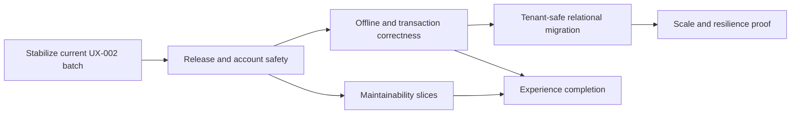

# VinOS Improvement Plan — July 2026

**Status date:** 2026-07-19  
**Execution status:** Milestone 1 in progress; release pipeline complete, account/team hardening next
**Scope:** Product trust, data correctness, release safety, maintainability, and production scale  
**Planning horizon:** Next 10–15 focused pull requests; milestones are dependency-based rather than calendar promises

## 1. Purpose

VinOS has moved beyond the original prototype stage. The app now has broad winery and vineyard coverage, a strong unit-test suite, offline synchronization, role-aware workflows, PostgreSQL-backed persistence, and a polished bilingual shell.

The next improvement cycle should not add more surface area first. It should make the existing product safe to change and safe to scale. The order is:

1. land and prove the current permission/integrity work;
2. prevent unverified code from reaching production;
3. close account, offline, deletion, and compound-workflow failure modes;
4. make relational persistence tenant-safe and verifiably consistent;
5. reduce the largest maintenance bottlenecks;
6. finish the whole-app experience on top of those foundations;
7. prove operational resilience before increasing production concurrency.

## 2. Current baseline

This plan was produced from the current working tree, including the in-progress UX-002 changes.

| Area | Current evidence | Planning implication |
|---|---|---|
| Mechanical health | dependency audit, `npm run lint`, `npm test`, `npm run build`, the fresh bundle-budget assertion, and the live production boot smoke pass; 619 pre-build tests plus 4 build-dependent bundle assertions pass across 88 tracked test files | Preserve the green baseline, but add missing integration and browser coverage |
| Stabilized scope | The permission, storage, sales, sync-conflict, integrity, and startup-safety batch is partitioned into reviewable commits | Start Milestone 1 without reopening the stabilized Milestone 0 concerns |
| Delivery | Pull requests and `main` pushes run mandatory release gates; deployment verifies one immutable image, applies reviewed migrations in a fail-closed job, and deploys the same digest | Preserve branch/environment protection and move next to account/team hardening |
| Testing | Vitest coverage is broad; no browser E2E runner or PostgreSQL integration job is configured | Add representative browser, database, offline, and concurrency tests |
| Persistence | `OrganizationState.data` JSONB is authoritative; vessel/lot relational writes run in a fire-and-forget background task | Treat the normalized tables as non-authoritative until consistency is measurable |
| Tenant model | Operational Prisma models use globally unique `id` primary keys, although application record IDs are reused across estates | Fix keys before expanding relational double-write or enabling relational reads |
| Sync | Versioned JSONB writes, field merge, scoped tombstones, retry, validation, and conflict recovery are implemented or in flight | Consolidate them around explicit compound transactions and idempotency |
| Maintainability | `src/App.tsx` is over 3,200 lines, `useWineryState.ts` over 2,400, `VaziModule.tsx` over 3,400, and the sync route over 1,700 | Extract by behavior and domain; avoid a big-bang rewrite |
| Experience | UX-001, UX-002, and Milestone 0 are complete; older UI plans still contain valuable but partially stale work | Continue from the current delivery log rather than restarting old phases |
| Documentation | `README.md` still describes an AI Studio starter and the repo uses CellarFlow, Vinea, MaraniOS, and VinOS identifiers | Establish one product/developer vocabulary and a trustworthy setup guide |

## 3. Priority rules

Use these rules whenever scope competes:

- **P0 — release or trust risk:** unauthorized actions, lost/duplicated data, cross-tenant behavior, unrecoverable offline changes, broken auth, or an unverified deployment.
- **P1 — scale or change risk:** architectural bottlenecks, incomplete observability, database migration safety, browser coverage, and high-friction core journeys.
- **P2 — refinement:** visual consistency, secondary workflow polish, performance tuning after measurement, and lower-frequency features.

Do not begin P2 work while a related P0 invariant is unproved.

## 4. Milestone 0 — Stabilize the current worktree

**Priority:** P0  
**Goal:** turn the current broad UX-002/integrity batch into reviewable, releasable units.

### Deliverables

- Finish permission-correct behavior for Vazi and sales, including every collection touched by each compound action.
- Finish storage deletion semantics: organization-scoped tombstones, referential-integrity checks, and explicit handling for locations referenced by movements, orders, dispatches, and bottling records.
- Finish sync conflict recovery UI with explicit choices, retry persistence, safe cancellation, and no implicit loss of queued work.
- Separate the batch into bounded commits or pull requests by concern: permission contracts, integrity/tombstones, conflict recovery, and documentation.
- Remove the stray fermentation temporary artifact after confirming it contains no unique work.
- Update the UX-002 delivery log with the actual test count and remaining scope.
- Re-run the gates from a clean checkout in this order: typecheck, unit tests, production build, bundle-budget test, and production-mode boot smoke test.

### Current execution note

- Permission contracts, storage/deletion integrity, and exact compound-conflict recovery are implemented and committed as a coherent end-to-end slice.
- The fermentation temporary artifact was compared with the active component, confirmed to be an older snapshot with no unique work, and removed.
- `npm run test:production-smoke` now boots the real production server against isolated temporary state and verifies liveness, SPA fallback, API 404 behavior, cache policy, and required-session-secret fail-fast behavior.
- Configured PostgreSQL initialization and startup schema-command failures now stop production before it serves traffic; development retains its explicit JSON fallback.
- The batch is partitioned into production-startup safety (`e36f18d`), permission and sync-integrity workflows (`971987d`), and primary-workspace test isolation (`bcf30c6`).
- Vitest excludes nested assistant worktrees, so the reported baseline now reflects only the 88 tracked primary-workspace test files; the DNS failure path is dependency-injected and deterministic rather than relying on live resolver timing.
- The clean-checkout gate passes in order: dependency audit, typecheck, 619 pre-build tests (with the 4 build-dependent checks skipped), production build, all 4 fresh bundle-budget assertions, and production-mode boot smoke.

### Exit gate

- Owner, Winemaker, Viticulturist, Lab Technician, Cellar Worker, and Read-Only matrices agree between navigation, controls, callbacks, and server authorization.
- A rejected, interrupted, or conflicted sync retains the complete local transaction and every deletion intention until the user resolves or discards it.
- No storage, sales, bottling, lot, vessel, or inventory reference can be orphaned through a supported UI action or sync payload.
- The working tree contains no accidental temporary files, and each change set is independently reviewable.

## 5. Milestone 1 — Release and account safety

**Priority:** P0  
**Goal:** make every production revision reproducible, verified, and safer at the identity boundary.

### 5.1 Continuous integration and deployment

- Add a pull-request/push CI workflow that runs typecheck, tests, production build, and bundle budgets.
- Run the build before the bundle-budget assertion; the current budget test can otherwise inspect an older `dist` or skip when `dist` is absent.
- Add a production-mode boot smoke test for `/api/health`, SPA fallback, and required-secret fail-fast behavior.
- Build one immutable container/artifact, verify it, and deploy that artifact instead of rebuilding from source during the deployment job.
- Add a protected production environment with deployment concurrency and an explicit revision summary.
- Replace startup `prisma db push` with reviewed migrations and a controlled migration step. A schema failure must fail deployment rather than silently change persistence mode. **Implemented.**
- Add a non-deploying dependency/security scan and document how findings are triaged; do not auto-upgrade production dependencies without tests. **Implemented.**

### Current execution note — 2026-07-19

- `.github/workflows/ci.yml` now runs locked installation, Prisma generation, typecheck, pre-build tests, production build, fresh bundle budgets, and production boot smoke for pull requests and `main` pushes; the deployment workflow reuses the same gate.
- The deploy workflow builds one commit/run-tagged image, verifies secret fail-fast and the full HTTP contract inside that exact container, pushes it to an immutable-tag Artifact Registry repository, resolves its digest, and deploys with `--image` rather than `--source`.
- The production job uses a non-cancelling concurrency key and the `production` GitHub environment, publishes a commit/revision/digest summary, and fails if Cloud Run's latest ready revision does not reference the verified digest.
- A reviewed baseline migration now covers the existing Prisma schema. The verified image runs it in a one-task, zero-retry Cloud Run job before service deployment; an existing `db push` database is baselined only after an exact schema-drift check, and every failure prevents the new revision from deploying.
- CI blocks high and critical production dependency advisories. Non-breaking lockfile refreshes removed the current high findings; the remaining transitive moderate `uuid` advisories and their accepted temporary mitigation are recorded in `docs/dependency-security.md`.
- Repository branch protection, the required CI status, production reviewers, and the first immutable-image deployment were confirmed configured/executed on 2026-07-19.
- The release pipeline portion of Milestone 1 is complete. Account/team hardening is now implemented and is awaiting the same immutable-image rollout for production.

### 5.2 Account and team hardening

- Rate-limit password recovery, resend-verification, invitation creation/read/accept, and OAuth callback failure loops. **Implemented.**
- Persist invitation token hashes rather than raw bearer tokens. **Implemented.**
- Consume invitations atomically so two requests cannot accept the same invitation. **Implemented.**
- Add a server-side session version or revocation timestamp; password reset, account disable, role removal, and security-sensitive admin actions must invalidate old sessions. **Implemented.**
- Fail closed for recovery/invitation mail in production. Never emit live bearer links to production logs as a fallback. **Implemented.**
- Add audit events for password reset, invitation lifecycle, membership/role changes, impersonation, and runtime configuration changes without recording secrets. **Implemented.**

### Account-hardening execution note — 2026-07-19

- Recovery, verification-resend, invitation, and OAuth callback quotas share the PostgreSQL-backed limiter, with hashed IP/identity keys so diagnostic state does not disclose account identifiers or bearer values.
- Existing invitation values are SHA-256 transformed by migration; new invitations persist only a digest. Acceptance uses a conditional single-use claim, membership upsert, and active-organization change in one PostgreSQL transaction, with equivalent single-process fallback behavior.
- Sessions carry a server-owned version. Password reset, account enable/disable, and security-sensitive master-admin updates increment it; live authorization also rejects disabled/deleted users and removed active memberships immediately.
- Production mail delivery now requires SMTP and reports only generic operational failures. Full verification, reset, and invitation links remain available solely through the development console transport.
- Durable security events cover recovery, verification, invitations, OAuth failures/success, account administration, impersonation, and runtime OAuth changes; IP addresses are HMAC-hashed, secret-shaped metadata keys are discarded, and master administrators can inspect the recent durable trail through a protected endpoint.
- Focused regression coverage exercises recovery enumeration resistance and throttling, OAuth failure throttling, invitation replay/race protection in JSON and PostgreSQL paths, session revocation, account disablement, membership removal, migration behavior, and production mail logging safety.

### Exit gate

- No deploy can run from an unverified revision.
- Auth security tests cover replay, race, enumeration, throttling, revocation, and cross-organization membership cases.
- A failed database migration prevents the new revision from serving traffic.

## 6. Milestone 2 — Offline and compound-transaction correctness

**Priority:** P0/P1  
**Goal:** guarantee that business actions are applied once, completely, and recoverably online or offline.

### Deliverables

- Define server-owned commands for the highest-risk multi-collection operations: harvest-to-intake, transfer, fermentation completion, bottling, storage movement, sales reservation/dispatch/cancellation, and cellar material consumption.
- Give every command a client-generated idempotency key and persist its result. Retrying after timeout or reconnect must return the original result, not duplicate ledgers.
- Validate permissions and invariants once at the command boundary; the UI may predict eligibility but the server remains authoritative.
- Persist deletion tombstones and pending command intent in organization-scoped durable client storage until the server acknowledges them.
- Centralize referential and quantity invariants so sync, direct commands, imports, and admin tools cannot apply different rules.
- Put hard payload, record-count, attachment, and queue limits behind clear user-facing recovery messages.
- Add deterministic two-client simulations for edit/edit, edit/delete, delete/delete, role-change-mid-sync, retry-after-timeout, and partial-connectivity cases.
- Measure sync payload size, merge time, retry count, conflict rate, and queue age before considering a CRDT rewrite.

### Exit gate

- Replaying the same command produces one business event and one set of ledger effects.
- A forced crash at every persistence boundary either commits the complete command or leaves it safely retryable.
- The two-client test matrix has no silent overwrite, resurrection, duplicate stock/cost entries, or lost tombstone.
- CRDT work remains deferred unless measured conflict patterns show that command/delta sync is insufficient.

## 7. Milestone 3 — Tenant-safe relational persistence

**Priority:** P1 with a P0 tenant-isolation prerequisite  
**Goal:** move from whole-state JSONB to queryable relational authority without a risky big-bang cutover.

### 7.1 Correct the relational foundation

- Replace globally keyed operational records with tenant-safe identity, such as a database primary key plus `@@unique([organizationId, id])`, or a composite primary key where Prisma relations remain practical.
- Add organization-scoped foreign keys for lot, vessel, block, location, order, dispatch, bottling, and ledger relationships. A reference must not resolve across organizations.
- Add indexes for organization plus the fields used by history, date, status, lot, vessel, block, and location queries.
- Migrate existing rows with collision detection and a reconciliation report before enforcing constraints.

### 7.2 Make dual persistence verifiable

- Replace the fire-and-forget vessel/lot write loop with an explicit transactional projection or durable outbox worker.
- Project creates, updates, and deletes; the current upsert-only loop cannot remove stale relational rows.
- Record projection version, source snapshot version, latency, failures, and last successful reconciliation per organization.
- Add a repeatable reconciliation command that compares normalized rows with JSONB and produces field-level drift output without exposing tenant data.
- Shadow-read one bounded domain at a time in this order: lots/vessels, fermentation/labs/transfers, inventory/storage/sales, vineyard, then remaining collections.

### 7.3 Cut over incrementally

- Require a sustained zero-drift window and restore test before enabling relational reads for a domain.
- Use per-domain feature flags with instant fallback during the observation window.
- After all domains are authoritative, retain JSONB as a versioned export/backup format rather than the live write model.

### Exit gate

- Duplicate human-readable IDs in separate organizations coexist without collision or cross-tenant update.
- Create/update/delete parity is proven for each cut-over domain.
- Backup restore can rebuild both authoritative rows and a complete export snapshot.
- Whole-organization sync no longer requires serializing every unchanged collection.

## 8. Milestone 4 — Maintainability and contract clarity

**Priority:** P1  
**Goal:** reduce regression risk while the data migration proceeds.

### Deliverables

- Split `src/App.tsx` into routing/navigation, authenticated shell, workspace context, overlays, and feature adapters.
- Split `useWineryState.ts` into session/workspace, local persistence, sync orchestration, and domain command hooks.
- Split `VaziModule.tsx` by vineyard planning, phenology, IPM, scouting, sampling, harvest, and maps.
- Split the sync route into request schema parsing, authorization, invariant validation, merge/command execution, and response projection.
- Define shared runtime request/response schemas and infer TypeScript types from them, or add conformance tests if a new schema library is not adopted.
- Introduce one canonical record-ID policy and one canonical product/storage key prefix; preserve backward-compatible migration for existing local data.
- Replace native `alert`/`confirm` calls in touched workflows with shared localized dialog/toast primitives.
- Configure real ESLint rules. Keep `typecheck` as a separate script instead of naming `tsc --noEmit` “lint.”
- Set a soft review threshold: touched files above roughly 800 lines need an extraction plan, not an automatic mechanical split.

### Exit gate

- Feature modules depend on narrow command/state interfaces rather than the full application state object.
- API validation, authorization, and invariant failures have stable error codes and localized client handling.
- New code cannot introduce unknown Tailwind utilities, unlabeled controls, untranslated user-facing strings, or direct native confirmation dialogs without a failing check.

## 9. Milestone 5 — Experience completion and browser proof

**Priority:** P1/P2 after related trust gates  
**Goal:** complete the current whole-app UI/UX plan as coherent journeys, not isolated screens.

### Deliverables

- Continue `docs/ui-ux-improvement-plan.md` from UX-002; do not restart completed auth, role, localization, PWA-update, or accessibility work.
- Establish canonical URLs for modules and entity detail so Back, Forward, refresh, share, invitation, QR, alert, and search destinations preserve context.
- Build shared field, form, dialog, feedback, empty/loading/error, and responsive data-view primitives before broad visual cleanup.
- Add draft/dirty-navigation protection, duplicate-submit prevention, idempotent completion, undo for reversible deletion, and explicit irreversible confirmation.
- Complete responsive card/priority-column views for dense Inventory, Costs, Sales, compliance, and admin tables.
- Finish English/Georgian parity, heading/focus order, 200% zoom, reduced motion, and light/dark AA checks.
- Add browser E2E coverage for auth/recovery/invitation, organization switching, intake, fermentation, lab, transfer, bottling, sale, offline queue/reconnect/conflict, document export, and settings/team.
- Add a small visual-regression matrix for 375, 768, and 1440 px in both themes and languages; expand only for high-risk screens.

### Exit gate

- The representative vineyard-to-bottle and order-to-dispatch journeys pass by keyboard, touch, online, offline, and reconnect.
- No major screen has horizontal page overflow, a dead-end empty state, or mixed-language controls.
- Browser tests prove role-aware destinations and mutation visibility against a running server rather than static markup alone.

## 10. Milestone 6 — Observability, recovery, and scale proof

**Priority:** P1  
**Goal:** know when the product is unhealthy and recover it before increasing production concurrency.

### Deliverables

- Replace the in-memory client-error ring buffer with durable, retention-limited storage or an external telemetry sink.
- Emit structured logs with request/correlation ID, organization-safe pseudonymous context, command/idempotency ID, result code, duration, and revision. Never log tokens, sensitive field values, or full sync payloads.
- Add metrics and alerts for authentication abuse, database fallback, sync conflict/retry/failure, projection drift, queue age, payload size, attachment failures, and command latency.
- Keep `/api/health` as liveness and add a readiness probe for required database/schema state. Optional integrations should report degraded, not take down core operations.
- Add automated database backups plus a scheduled restore drill into an isolated environment. Record measured RPO/RTO instead of assuming them.
- Run multi-instance and load tests with shared PostgreSQL, concurrent sync, deploy during activity, and instance termination during writes.
- Raise Cloud Run `max-instances` gradually only after the load, consistency, and observability gates pass.
- Record representative Web Vitals and route bundle measurements; optimize the large Vazi/chart/export chunks only where user timing shows value.

### Exit gate

- Operators can identify the affected revision and failure class without accessing tenant payloads.
- A documented restore drill succeeds and its measured recovery objectives meet the agreed service target.
- Multi-instance testing produces no stale authorization, duplicate commands, lost writes, or cross-tenant reads.
- Scaling configuration and the admin deployment-status screen report the same evidence-based readiness state.

## 11. Recommended first 10 pull requests

1. Finish and test Vazi/sales permission contracts.
2. Finish storage deletion integrity and scoped tombstone durability.
3. Finish conflict-resolution recovery and split the current work into reviewable commits.
4. Add CI with build-before-budget, unit/type gates, and production boot smoke test.
5. ✅ Add recovery/invitation throttling, hashed invitations, atomic acceptance, and session revocation.
6. Add PostgreSQL integration tests and migration validation in CI.
7. Migrate vessel/lot relational identity to tenant-safe keys and add collision tests.
8. Replace background vessel/lot upserts with a durable, deletion-aware projection plus reconciliation report.
9. Introduce idempotent server commands for transfer and bottling as the first compound-workflow slice.
10. Add browser E2E for auth, role switching, transfer/bottling, offline retry, and conflict resolution.

Extraction of the application shell and state hook can proceed in small parallel PRs after PR 4, provided it does not overlap the active workflow files.

## 12. Program scorecard

Review these measures at the end of every milestone:

| Dimension | Target |
|---|---|
| Release | 100% of production revisions built from a CI-verified immutable artifact |
| Authorization | 100% of supported role/action combinations covered at UI callback and server boundary |
| Data integrity | Zero orphan, duplicate, cross-tenant, or silent-loss outcomes in the deterministic concurrency suite |
| Offline | 100% of interrupted/conflicted test transactions recoverable or explicitly discarded by the user |
| Relational migration | Zero unexplained drift for the required observation window before each domain cutover |
| Browser quality | Zero serious/critical accessibility violations and zero page-level overflow in the core matrix |
| Localization | Zero known mixed-language states in core journeys; EN/KA behavior remains equivalent |
| Operations | Restore drill passes; readiness, alerts, and deployment status agree with live infrastructure |
| Performance | Initial bundle budget remains green; route and Web Vitals regressions block release after baselines are recorded |

## 13. Explicit deferrals

- Do not adopt CRDTs until conflict telemetry shows a problem that idempotent commands and delta sync cannot solve.
- Do not cut all 37 operational collections to relational authority at once.
- Do not increase Cloud Run concurrency merely because PostgreSQL is configured.
- Do not begin a whole-app visual rewrite before permission, deletion, offline, and release gates are closed.
- Do not add new ERP modules until the existing vineyard-to-bottle and order-to-dispatch chains are proven end to end.
