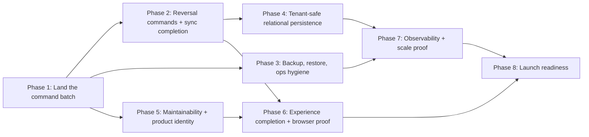

# VinOS Whole-App Improvement Plan — 2026-07-20

**Status date:** 2026-07-21
**Supersedes:** `docs/improvement-plan-2026-07-19.md` (Milestones 0–1 of that plan are complete; its Milestone 2 is carried forward here as Phase 1)
**Scope:** the entire product — data correctness, release safety, persistence architecture, maintainability, experience, operations, and launch readiness
**Planning horizon:** the next 12–18 focused pull requests; phases are dependency-ordered, not calendar promises

## 1. Purpose

The July cycle changed the risk profile of the product. Release safety (verified immutable images, reviewed migrations, protected environments), account/team hardening, permission-correct UI, and Georgian localization are done and deployed. All seven planned idempotent server commands now exist and are tested, and every command-created business event now has a supported append-only correction path.

The character of the remaining risk has therefore shifted:

1. the largest single risk today is that the now-green **command-architecture and correction batch is still sitting uncommitted** in the working tree — the most valuable work of the cycle is currently the least protected;
2. transfer, fulfilled-sale, bottling, cellar-operation, harvest-intake, and fermentation-completion corrections now use complete append-only reversal commands;
3. the business now runs on a production database with **no proven backup/restore drill**;
4. relational persistence is still tenant-unsafe and non-authoritative;
5. the codebase still concentrates regression risk in a few multi-thousand-line files, a stale README, four product names, and a broken lint configuration;
6. a complete marketing asset kit exists in the tree — launch is clearly intended, and the plan should treat launch readiness as real scope rather than an afterthought.

## 2. Current baseline (measured 2026-07-20)

Every row below was re-measured against the working tree today rather than copied from the previous plan.

| Area | Evidence | Implication |
|---|---|---|
| Test suite | Latest full run: **886 tests across 123 files, all passing**; typecheck, production build, production smoke (including liveness/readiness separation), and bundle budget also pass. The PostgreSQL suite remains environment-gated and requires a disposable `TEST_DATABASE_URL` | Preserve the green local baseline and run the new reversal races in the required PostgreSQL CI gate |
| Working tree | 127 tracked files modified plus 52 untracked paths after the lint cleanup, including `lib/commands/`, `server/commands/`, `server/idempotentCommands.ts`, `server/routes/commands.ts`, the readiness/recovery tooling, the idempotent-command migration, and `tests/postgres/` | The command, correction, readiness, recovery, and lint architecture is green but remains uncommitted; partition it into reviewable commits before merge |
| Branch state | `feat/georgian-localization` is 38 commits ahead of `origin/main` and carries CI, security, stabilization, and command work; all `codex/*` and worktree branches are merged into it | It is the de-facto integration branch under a misleading name; merge and return to short-lived branches |
| Commands | All seven command domains are implemented with idempotency claims, row-lock serialization, durable client recovery, and PostgreSQL race tests; every reversible business event has its paired correction command | Preserve the command contract as new workflows are added |
| Undo gap | New command-created transfers, sales dispatches, bottling runs, cellar operations, harvest intakes, and fermentation completions have permission-checked append-only correction paths | Phase 2 command correctability is complete |
| Persistence | `OrganizationState.data` JSONB authoritative; `Vessel` and `WineLot` still use globally unique `id` primary keys with a separate `organizationId` column; `IdempotentCommand` already models tenant-safe identity via `@@unique([organizationId, commandId])` | The old Milestone 3 tenant-key work has a template to follow and remains unstarted |
| Backups | The deployment workflow now encodes 30 retained automated Cloud SQL backups, a 02:00 UTC window, seven days of PITR logs, and backup retention after instance deletion; it has not yet been applied and verified on the live instance, and no restore drill is on record | Deploy and verify the policy, then complete the isolated restore drill before treating recovery as proven |
| Localization | Georgian data-view backlog cleared through commit `e486b49`; shared enum labels in `lib/enumLabels.ts`; `lib/i18n.ts` also carries partial `it`/`fr`/`de` dictionaries | Protect EN/KA parity with an automated gate; decide the stub locales' fate |
| Dead surface | `components/MasterAdminPortal.tsx` is now lazy-mounted from Settings only when `/api/auth/login` or `/api/auth/me` issues `isMasterAdmin: true`; cached identity cannot restore the capability, impersonated sessions receive `false`, and the return-to-admin path is visible | The unreachable 1,896-line surface is retired as dead code without weakening server authority |
| Large files | `VaziModule.tsx` 3,425 · `src/App.tsx` 3,353 · `useWineryState.ts` 2,679 · `MasterAdminPortal.tsx` 1,896 · `server/routes/sync.ts` 2,959 · `server/routes/auth.ts` 1,361 | Old Milestone 4 extraction targets unchanged; the sync route is now the largest server extraction priority |
| Lint | Real ESLint 9 flat config now scans the primary Vite/React/Express/TypeScript tree with zero warnings; `typecheck` is separate and both run in CI. Core correctness, hooks, unused imports, import duplication, and 28 recommended `jsx-a11y` rules block regressions | Migrate legacy labels/clickable cards so the six explicitly documented accessibility-debt rules can become blocking |
| Dialogs | The transfer rollback `alert`/`confirm` pair is retired; native dialogs remain in six other workflow components | Replace them when each corresponding correction workflow is touched |
| Dependencies | The unused `@google-cloud/firestore` dependency, false `USE_FIRESTORE` deployment state, obsolete Firebase blueprint/rules, and dead client-auth fixture were removed after a repo-wide reference sweep; `rxdb` remains genuinely used by the durable sync queue | Keep scheduled production audits green and update dependencies deliberately rather than carrying speculative backends |
| Identity/docs | `README.md` is still the AI Studio starter; the product is simultaneously `maranios` (package), VinOS (docs), MaraniOS (UI), CellarFlow (repo/GCP), and `vinea_*` (localStorage keys) | One name, one README, one plan index |
| Marketing | `marketing-assets/` (untracked) holds a complete bilingual kit — screenshots, contact sheets, posters, two videos, copy, claim guardrails, checksummed manifest | Decide storage (large binaries do not belong in git history) and wire into launch scope |
| E2E | No browser test runner is configured | Old Milestone 5 gap unchanged |

## 3. Priority rules

Unchanged from the previous cycle, and they still bind:

- **P0 — release or trust risk:** lost/duplicated/uncorrectable data, unproved backups, cross-tenant behavior, broken auth, unverified deployment, red or nondeterministic required suites.
- **P1 — scale or change risk:** architectural bottlenecks, missing observability, migration safety, browser coverage, high-friction core journeys.
- **P2 — refinement:** visual polish, secondary workflows, measured performance tuning, launch collateral.

Do not begin P2 work while a related P0 invariant is unproved.

## 4. Phase 1 — Land the command architecture (P0)

**Goal:** the most valuable work of the cycle is committed, reviewed, merged, and deployed.

### Deliverables

- **Completed 2026-07-20:** fix the shared-worker route-test isolation failure and stabilize discovery; the full local suite now consistently discovers 122 files and 880 passing tests after the readiness and recovery slices.
- Partition the uncommitted batch into reviewable commits by concern: shared idempotency executor + migration, each command slice with its client and tests, the PostgreSQL suite and CI gate, and the plan documents.
- Merge `feat/georgian-localization` into `main` through the protected pipeline, deploy the verified image, and confirm the revision digest. Retire the branch name; subsequent work returns to short-lived, single-concern branches.
- **Completed 2026-07-20:** implement the seventh command, `storage.movement`: source-linked receipt, paired internal relocation, and explicit adjustment now enforce location capacity and lot-level finished-goods availability while updating the movement ledger and bottling placement evidence atomically, without duplicating sales-owned dispatch or bottling-owned same-transaction placement.
- Run the clean-checkout gate sequence (typecheck, unit, build, bundle budget, production smoke, PostgreSQL suite) after the merge and record the counts in the delivery log.

### Exit gate

- `main` contains the full command architecture; CI and the PostgreSQL gate are green from a clean checkout, twice consecutively, with identical test discovery.
- Production serves a revision built from the merged commit.

## 5. Phase 2 — Reversal commands and sync completion (P0)

**Goal:** every business action recorded through a command is correctable through a command, and the offline path is measurably equivalent.

### Deliverables

- **Completed 2026-07-20:** define the shared reversal reference/receipt contract. A reversal is itself an idempotent command that references the original `(organizationId, commandId)`, validates that intervening state still permits compensation, and posts explicit compensating ledger entries rather than deleting history.
- **Completed 2026-07-20:** reversals shipped in risk order for transfer, sales stock, bottling, cellar operation, harvest intake, and fermentation completion. Each uses a server-owned append-only correction rather than legacy deletion.
- **Transfer reversal evidence:** `cellar.transfer.reverse` captures/restores exact pre-transfer vessel and lot state, rejects stale compensation after dependent changes, retains voided blend lots as audit evidence, marks the original record, appends a paired correction record, ignores the correction as a second physical lineage event, and supports durable replay plus the development/offline pure-command fallback. The old delete-style transfer rollback path is removed.
- **Cellar-operation reversal evidence:** `cellar.operation.reverse` captures the exact lot, operating-vessel, inventory, cost, and audit provenance before posting; rejects compensation after any dependent change; restores physical state; appends a negative linked cost and signed audit correction; keeps both original and correction visible in passports and Annex 13 while excluding both from current physical lineage; survives client retry; and is covered by domain, route, sync-forgery, UI, reporting, and PostgreSQL race tests.
- **Harvest-intake reversal evidence:** `cellar.harvest-intake.reverse` captures the generated lot plus exact harvest, vessel, cost, and audit before-state; rejects correction after any fermentation, lab, transfer, bottling, certification, stock, sales, cost, or attachment dependency; voids rather than deletes the generated lot; restores harvest and vessel state; appends negative cost, receiving, and signed audit correction records; excludes the reversed pair from live Rtveli totals and physical lineage while retaining both legs in Annex 3, Annex 4, and lot passports; survives client retry; and is covered by domain, route, sync-forgery, UI, reporting, and PostgreSQL race tests.
- **Fermentation-completion reversal evidence:** `cellar.fermentation-complete.reverse` captures the active lot, assigned vessel, final chemistry reading, lifecycle description, and signed audit provenance; refuses stale or dependent correction; reopens the lot and restores the vessel operation without deleting the final physical reading; appends a distinct correction row and signed audit event; excludes correction rows from curves, alerts, dashboards, vessel telemetry, and qvevri metrics while retaining both legs in the journal and lot passport; survives durable client retry; and is covered by domain, route, permission, sync-forgery, UI, reporting, and PostgreSQL race tests.
- **Sales reversal evidence:** `sales.stock.reverse` retains the original dispatch, appends a capacity-checked inbound return and compensating sales entry, cancels fulfilled reservations instead of reopening stock demand, rejects duplicate or forged pairs, removes reversed revenue from active analytics, preserves both legs in Annex 8, and supports durable replay plus the development/offline pure-command fallback. The legacy dispatch tombstone UI is removed.
- **Completed 2026-07-21:** retire the legacy client-side partial undo paths entirely once each domain has a server-owned reversal; a single correction model must remain. The unreachable legacy bottling rollback implementation was deleted, leaving server-owned append-only reversal commands as the only bottling correction model.
- **Completed 2026-07-20:** add the deterministic two-client matrix against the real authenticated `/api/sync` boundary, paired with the real command-route replay/race suites. It proves same-field edit conflicts, non-overlapping reconnect merges, both edit/delete orderings, idempotent delete/delete, live role downgrade, and lost-response retry. Versioned client tombstones now include the server baseline plus a stable content fingerprint; a private bounded server deletion ledger prevents stale full-collection payloads from resurrecting deleted records; explicit local-delete conflict resolution durably rebases before retry. The ledger is capped at 20,000 newest lifecycle entries and never appears in client projections.
- **Completed 2026-07-20:** record privacy-safe sync and command telemetry so future concurrency decisions are evidence-based. Sync metrics cover payload bytes, record/tombstone counts, merge and total duration, retry count, conflict rate, and rejection rate; command metrics cover known command type, execution/replay/failure, queue age, and latency. The newest 500 samples are aggregated in memory, payload-free structured metrics are emitted to production logs, untrusted values are clamped, and only the master-admin `/api/admin/operational-metrics` endpoint exposes the aggregate snapshot. Tenant ids, usernames, command ids, and field values are never recorded.
- **Completed 2026-07-20:** enforce bounded sync and durable-command work. `/api/sync` rejects malformed bodies, collections over 20,000 records, aggregate payloads over 75,000 records, or deletion ledgers over 20,000 entries before merge/persistence, using stable 400/413 recovery codes that explicitly retain local changes. Browser command recovery is capped at 24 intents and 128,000 serialized characters per intent; a full, oversized, unavailable, quota-exhausted, or unverifiable recovery store fails closed before the request is sent. Existing attachment file and aggregate inline-byte limits remain enforced. Helper, HTTP-boundary, queue-capacity, idempotent-replacement, and storage-failure tests cover the contract.

**Local implementation status:** Phase 2 is complete. Its remaining release evidence is the environment-gated PostgreSQL suite and clean-checkout protected merge from Phase 1.

### Exit gate

- Every command-created record has a supported, permission-checked correction path that survives replay and crash-retry.
- The two-client matrix shows no silent overwrite, resurrection, duplicate ledger, or lost tombstone.

## 6. Phase 3 — Backup, restore, and operations hygiene (P0, parallel with Phase 2)

**Goal:** the production database stops being the only copy of every winery's records.

This is pulled forward from the old Milestone 6 because it is cheap relative to its risk and independent of the code phases.

### Deliverables

- **Implemented locally 2026-07-20; live verification pending:** the deployment workflow fail-closes on a malformed or cross-project/region Cloud SQL connection name, then enforces a 02:00 UTC automated backup window, 30 retained backups, seven days of transaction logs, point-in-time recovery, and retained backups after instance deletion before migrations or service rollout. This is not marked operationally complete until a protected deployment confirms the live instance settings.
- **Tooling completed locally 2026-07-20; live drill pending:** `db:state-checksums` produces deterministic SHA-256 reports over every `OrganizationState`, neutralizing JSONB key and row ordering while preserving arrays, types, versions, and timestamps. Organization ids are pseudonymized and no winery names or JSON contents enter the artifact. `docs/cloud-sql-recovery-runbook.md` defines the isolated-target, write-freeze, backup/restore, exact comparison, readiness, RPO/RTO, review, and cleanup procedure. The deliverable remains open until the first live drill passes and the owner accepts its measured RPO/RTO.
- **Completed locally 2026-07-20:** add a public, non-cacheable `/api/ready` contract distinct from `/api/health`. It applies a bounded three-second PostgreSQL/schema read probe, rejects incomplete hydration, active backend write errors, unavailable/mismatched PostgreSQL, and unsafe production-local JSON with HTTP 503, while reporting optional GCS backup, AI, email, and Google OAuth state as non-blocking degradation. The response exposes only a backend class and stable failure class—never database targets or raw errors. Production smoke proves liveness/readiness separation, the container pre-push check expects its intentionally unsafe local backend to fail readiness, and the deployed digest gate now requires `/api/ready` to return 2xx.
- Close the standing security follow-ups: confirm the stale `us-central1` duplicate Cloud Run service is deleted and rotate the Google OAuth client secret and SMTP app password if that has not already happened; record the confirmation date in `docs/dependency-security.md`.
- **Completed locally 2026-07-20; first scheduled run pending:** `.github/workflows/scheduled-operations.yml` runs the production dependency audit and a read-only Prisma drift check every Monday. The drift job resolves the latest ready revision and executes `db:check-drift` from that exact immutable image with the production Cloud SQL attachment. Missing repository variables/auth fail closed, URLs are redacted on errors, runs cannot overlap, and the job cannot apply migrations. During this work the pre-deploy migration job was also corrected to use `--execute-now`; previously `gcloud run jobs deploy --wait` updated the job definition without proving an execution.

### Exit gate

- A documented restore drill has succeeded and its measured recovery objectives are accepted by the owner.
- No stale service or unrotated credential remains from the July security review.

## 7. Phase 4 — Tenant-safe relational persistence (P1; P0 prerequisite inside)

**Goal:** move from whole-state JSONB toward queryable relational authority without a big-bang cutover. Carried forward from the old Milestone 3 with one addition: the `IdempotentCommand` model already demonstrates the target identity pattern.

### Deliverables

- **4.1 Foundation (P0 prerequisite):** replace globally keyed `Vessel`/`WineLot` primary keys with database identity plus `@@unique([organizationId, id])` (the pattern `IdempotentCommand` already uses); add organization-scoped foreign keys and indexes for history/date/status/lot/vessel/block/location queries; migrate existing rows with collision detection and a reconciliation report before enforcing constraints.
- **4.2 Verifiable dual persistence:** replace the fire-and-forget vessel/lot write loop with a transactional projection or durable outbox that also projects deletes; record projection version, latency, failures, and last reconciliation per organization; add a repeatable drift-report command that never exposes tenant data.
- **4.3 Incremental cutover:** shadow-read one bounded domain at a time (lots/vessels first) behind per-domain flags with instant fallback; require a sustained zero-drift window and a passed restore test before each domain's relational reads become authoritative; JSONB remains the export/backup format afterward.

### Exit gate

- Duplicate human-readable IDs in separate organizations coexist without collision or cross-tenant update.
- Create/update/delete parity is proven per cut-over domain; whole-organization sync no longer serializes every unchanged collection.

## 8. Phase 5 — Maintainability and product identity (P1, parallel-friendly)

**Goal:** reduce regression risk and finish the repo's identity so new contributors and reviewers can trust what they read.

### Deliverables

- Split the four risk concentrations by behavior, respecting the soft rule that touched files over ~800 lines need an extraction plan: `src/App.tsx` (routing/shell/workspace/overlays), `useWineryState.ts` (session, persistence, sync orchestration, domain command hooks), `VaziModule.tsx` (planning, phenology, IPM, scouting, harvest, maps), `server/routes/sync.ts` and `server/routes/auth.ts` (schema parsing, authorization, invariants, execution, projection).
- **Completed 2026-07-21:** mount `MasterAdminPortal.tsx` behind a fresh server-issued master capability. The client never infers it from role/username, strips it from cache, hides it during impersonation, exposes a tested return-to-admin banner, and keeps every admin action server-authorized.
- **Completed locally 2026-07-20:** replace the broken Next.js config with ESLint 9 flat configuration for Vite/React/Express, TypeScript, hooks, accessibility, and import hygiene. `npm run lint` now finishes with zero warnings, `npm run typecheck` remains independent, and CI runs both. The migration removed unused imports, duplicate imports, obvious dead locals, unstable memo/effect dependencies, and trailing whitespace. Twenty-eight recommended accessibility rules block now; six legacy rules (`label-has-associated-control`, clickable/static element keyboard semantics, noninteractive tab index/interactions, and autofocus) are explicitly isolated in the config until shared component migrations clear their measured backlog.
- Rewrite `README.md` for the real product: name, architecture sketch, setup (PostgreSQL and JSON fallback), test commands (including the PostgreSQL suite), deployment pointers, and the plan-document index.
- Choose one product name; migrate the package name, UI strings, and `vinea_*` localStorage keys behind a backward-compatible read; document the retirement of the other names.
- **Completed locally 2026-07-20:** remove `@google-cloud/firestore`, `firebase-blueprint.json`, `firestore.rules`, the unused hard-coded client-auth fixture, and the false `USE_FIRESTORE` deployment/config path. System Health can no longer claim an unimplemented Firestore backend, and `security_spec.md` now describes the actual server-session, organization-membership, command, sync, audit, and attachment controls.
- Replace the 10 remaining native `alert`/`confirm` calls with the shared localized dialog/toast primitives as their workflows are touched.
- Consolidate the plan documents: this file becomes the active plan; `improvement-plan.md`, `production-readiness-plan.md`, and `design-plan.md` get supersession headers pointing here and to the UX plan's delivery log.

### Exit gate

- Feature modules depend on narrow command/state interfaces rather than the whole application state object.
- ESLint runs in CI with zero suppressed errors; no unreachable component ships in the bundle; the README describes the product a new developer actually finds.

## 9. Phase 6 — Experience completion and browser proof (P1/P2)

**Goal:** finish the whole-app experience as coherent journeys and prove them in a real browser. Continues `docs/ui-ux-improvement-plan.md` from its delivery log — completed auth, permission, localization, and PWA work is not reopened.

### Deliverables

- Verify and close UX-003 in the delivery log (simulated-role controls no longer exist in the tree; the log still lists it as pending) and re-scope UX-008, whose fabricated harvest path was replaced by the `cellar.harvest-intake` command.
- Deliver the remaining UX backlog: QR/deep-link intent preservation through authentication (UX-004), draft/dirty-navigation protection on long forms (UX-005), accessible form contracts (UX-006), and release-blocking Georgian parity (UX-007).
- Establish canonical URLs for modules and entity detail so Back/refresh/share/QR/alert destinations preserve context.
- **Completed 2026-07-21:** make dense lineage graphs usable at every supported width. Depth bands wrap after eight rows instead of growing unbounded vertically; the canvas has a true full-screen mode with Escape and automatic fit on both entry and exit; and the compact sync indicator removes the last page-level overflow at 375 px. Geometry tests cover dense bands, while browser proof recorded a desktop fit transition of 61% → 98% → 60% and confirmed the mobile full-screen canvas stays within the viewport.
- **Completed 2026-07-21:** extend the National Wine Agency connection without inventing an official API. CellarFlow can search and link the public producer directory, open the separate official producer portal, classify stored verification evidence under an explicitly internal 90-day re-check policy, and re-read the server-stored producer identity in one click. The re-check ignores client-supplied identity, preserves mismatches, appends signed audit evidence, and is covered by unit and route tests. Live browser proof linked and re-checked registration `1100`; the Integration Hub has zero horizontal overflow at 375 px.
- Adopt Playwright (or equivalent) and cover the journeys that already exist: auth/recovery/invitation, organization switching, intake→fermentation→transfer→bottling, order→dispatch, offline queue/reconnect/conflict, and settings/team.
- Automate the Georgian leak scanner: the seeded-data TreeWalker Latin-word sweep that found the Vazi backlog becomes a repeatable browser test with a brand/technical allowlist, run in both languages — parity is now a regression gate, not a translation project.
- Decide the `it`/`fr`/`de` stub dictionaries: either commit to full parity behind the same gate or remove them from the language picker until a real demand exists.
- Add the small visual-regression matrix (375/768/1440 px, both themes, both languages) for high-risk screens only.

### Exit gate

- The vineyard-to-bottle and order-to-dispatch journeys pass by keyboard, touch, online, offline, and reconnect in CI browser runs.
- Zero unexpected Latin words in Georgian mode with seeded data; zero page-level overflow; no dead-end empty states on major screens.

## 10. Phase 7 — Observability and scale proof (P1)

**Goal:** know when production is unhealthy, and prove concurrency before raising it. Carries forward the rest of the old Milestone 6.

### Deliverables

- Replace the in-memory client-error ring buffer with durable, retention-limited storage or an external sink.
- Emit structured logs with request/correlation ID, pseudonymous organization context, command/idempotency ID, result code, duration, and revision; never log tokens, field values, or full sync payloads.
- Add metrics and alerts for auth abuse, database fallback, sync conflict/retry/failure, projection drift, queue age, payload size, and command latency — the telemetry from Phase 2 feeds this.
- Run multi-instance load tests with shared PostgreSQL: concurrent sync, deploy during activity, and instance termination during writes; raise Cloud Run `max-instances` only after these pass.
- Record Web Vitals and route bundle baselines; optimize the large Vazi/chart/export chunks only where user timing shows value.

### Exit gate

- Operators can identify the affected revision and failure class without reading tenant payloads.
- Multi-instance testing shows no stale authorization, duplicate command effects, lost writes, or cross-tenant reads.

## 11. Phase 8 — Launch readiness (P2, gated on P0 phases)

**Goal:** the marketing intent already visible in the tree becomes a safe, honest launch.

### Deliverables

- Move `marketing-assets/` binaries out of git history before they are ever committed: object-storage bucket or Git LFS, with the checksummed `manifest.csv` staying in-repo as the source of truth.
- Refresh the kit after the Georgian parity gate exists — the kit's own guardrails currently require "some specialist module labels remain English" wording that is likely already stale.
- Stand up the landing page using the kit's hero/contact-sheet/video sequence; keep every operational figure labeled as demo data per `marketing-facts.md`.
- Define the demo workspace refresh policy (the kit was captured from `testuser1` on 2026-07-14) so public materials never drift from the shipped product.
- Write user-facing help for the core journeys in both languages, and open a support/feedback channel that feeds this plan's backlog.
- Re-verify every claim guardrail in `marketing-facts.md` against the Phase 1–3 outcomes before any paid distribution.

### Exit gate

- No published claim exceeds what the deployed product does; no large binary lives in git history; a stranger can sign up, learn, and get help without the founder in the loop.

## 12. Recommended next 12 pull requests

1. Fix route-suite isolation and nondeterministic test discovery; make two consecutive full runs identical and green.
2. Commit the command architecture as partitioned, reviewable units; merge to `main`; deploy and verify the digest.
3. ✅ `storage.movement` command with client recovery and PostgreSQL race coverage.
4. ✅ Reversal-command contract plus the transfer reversal as the first slice.
5. Cloud SQL backups, restore drill script, drill report, and readiness probe.
6. ✅ Sales-stock, bottling, cellar-operation, harvest-intake, and fermentation-completion reversals, with legacy destructive UI retired for command-created records. Fermentation correction reopens the campaign without deleting chemistry evidence and keeps compensating rows out of live graphs and calculations.
7. ✅ Real ESLint flat config and separate typecheck in CI; the broken Next-based config, unused Firestore dependency, false backend mode, and vestigial Firebase files are removed locally. Follow-up: clear the six documented legacy accessibility rules and turn them on.
8. README rewrite, single product name with key migration, plan-document supersession headers.
9. Tenant-safe `Vessel`/`WineLot` identity migration with collision report (Phase 4.1).
10. Deletion-aware transactional projection with drift report (Phase 4.2, first domain).
11. Playwright bootstrap: auth, org switching, transfer/bottling journey, offline replay; automated Georgian leak scan.
12. ✅ MasterAdminPortal mounted behind server-issued master-admin capability, with impersonation return and browser proof.

Extraction PRs for `App.tsx`/`useWineryState.ts` can interleave from PR 7 onward wherever they do not overlap active workflow files.

## 13. Program scorecard

| Dimension | Target |
|---|---|
| Green baseline | Two consecutive clean-checkout runs with identical discovery and zero failures, unit and PostgreSQL suites |
| Correctability | 100% of command types have a tested reversal; zero records without a supported correction path |
| Recovery | Restore drill documented and repeated after schema changes; measured RPO/RTO meet the agreed target |
| Data integrity | Zero orphan/duplicate/cross-tenant/silent-loss outcomes in the concurrency and two-client suites |
| Relational migration | Zero unexplained drift for the observation window before each domain cutover |
| Maintainability | No touched file over ~800 lines without an extraction plan; ESLint green in CI; zero unreachable shipped components |
| Browser quality | Core journeys pass in CI browsers; zero serious/critical axe violations in the matrix |
| Localization | Automated EN/KA leak scan green with seeded data; stub locales resolved either way |
| Operations | Readiness, alerts, and deployment status agree with live infrastructure; multi-instance tests pass before concurrency raises |
| Launch honesty | Every public claim traceable to `marketing-facts.md` and verified against the deployed revision |

## 14. Explicit deferrals

- No CRDT adoption unless Phase 2 telemetry shows conflicts that idempotent commands and delta sync cannot absorb.
- No big-bang relational cutover of all operational collections; one domain at a time behind flags.
- No Cloud Run concurrency increase before the Phase 7 load gates pass.
- No whole-app visual rewrite; experience work continues journey-by-journey on the shared primitives.
- No new ERP modules and no `it`/`fr`/`de` expansion until the existing chains are proven end to end and the localization gate is automated.
- No committing of marketing binaries to git while the storage decision is open.
