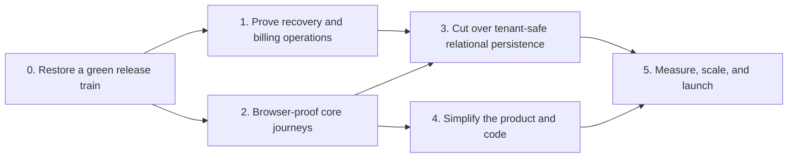

# VinOS App Improvement Plan — 2026-07-26

**Status date:** 2026-07-26

**Scope:** product reliability, core user journeys, persistence, maintainability, performance, and launch readiness

**Planning horizon:** the next 10–14 focused pull requests; effort bands are sequencing aids, not calendar promises
**Supersedes:** `docs/improvement-plan-2026-07-20.md` as the active whole-app plan. The older plan and `docs/ui-ux-improvement-plan.md` remain useful evidence and backlog history.

## Implementation update — 2026-07-26

The current workspace now implements the local, reviewable foundation for:

- durable WhatsApp task assignment, signed Meta webhooks, delivery/read/failure reconciliation, retry, migration, deployment configuration, and operations documentation;
- daily idempotent billing-renewal automation and a support/reconciliation runbook;
- Playwright desktop/mobile release journeys, authenticated task deep links, serious/critical axe checks, and CI browser gating;
- tenant/user-scoped form drafts for tasks and cellar operations with expiry, size, secret, and attachment protections;
- an explicit English/Georgian runtime contract with dictionary key-parity tests;
- tenant-safe composite vessel/lot keys, atomic JSONB-plus-relational projection, dry-run divergence checks, bounded explicit repair, and duplicate-ID isolation tests;
- privacy-safe LCP/INP/CLS and route/offline timing aggregation plus raw/gzip budgets for the shell and major lazy destinations;
- an accurate root README and documentation index.

These changes do not constitute a live production rollout. The push/PR/merge, immutable-image deployment, Meta template and webhook provisioning, TBC sandbox evidence, alert-channel ownership, and isolated Cloud SQL restore drill require repository/cloud/provider access and named owner decisions. Relational authority and delta sync also remain phased follow-on work; the vessel/lot slice deliberately keeps JSONB authoritative while divergence is observed.

## 1. Desired outcome

VinOS should become a dependable daily operating system for a winery, not merely a broad collection of working modules.

The next cycle should make four outcomes true:

1. the code that has passed review is on `main`, deployed from a verified image, and recoverable from a proven backup;
2. a worker can complete the vineyard-to-sale journey on desktop or mobile, in English or Georgian, online or offline, without losing context or draft work;
3. PostgreSQL becomes the authoritative, tenant-safe business-data store instead of a compatibility schema beside one large JSONB snapshot;
4. the team can change the app safely because the largest files, browser gaps, and operational blind spots are reduced.

New feature breadth is not the priority. VinOS already covers vineyard planning, harvest, intake, lots, vessels, operations, fermentation, lab work, bottling, stock, sales, compliance, integrations, AI-assisted drafts, billing, and audit. The priority is making those capabilities coherent and trustworthy.

## 2. Measured baseline

The baseline below was re-checked against the current workspace on 2026-07-26.

| Area | Current evidence | Implication |
|---|---|---|
| Branch and release | Before this plan file was added, the worktree was clean. `feat/georgian-localization` is 54 commits ahead of `origin/main` and 2 commits ahead of its remote branch. The branch now includes command safety, billing, workspace modernization, and operational vineyard maps, so its name no longer describes its role. | Landing and deploying the integration branch is the first priority. Long-lived integration work should end after this release. |
| Type safety | `npm run typecheck` passes. | Preserve as a required gate. |
| Lint | `npm run lint` fails on one `prefer-const` error at `components/WeatherTab.tsx:616`. | The current head cannot pass the configured release pipeline until this small regression is fixed. |
| Tests | The normal suite reports 133 passing files and 945 passing tests; the PostgreSQL suite is intentionally separate and CI-gated. The fresh bundle-budget test passes after the build. | Unit and contract coverage are strong. The main gap is real-browser journey coverage, not more isolated tests everywhere. |
| Build and boot | Production build passes. Production boot smoke passes liveness, fail-closed readiness, SPA fallback, API 404, cache policy, and secret fail-fast checks. | Preserve these gates and add deployed-journey proof. |
| Dependency security | `npm audit --omit=dev --audit-level=high` reports zero vulnerabilities. | Keep the CI and scheduled audit; do not turn dependency work into a feature cycle. |
| Recovery | Cloud SQL backup/PITR policy and checksum tooling exist, but `docs/cloud-sql-recovery-runbook.md` still records the first live restore drill as pending. | Recovery is configured, not proven. This remains a P0 trust gap. |
| Billing | TBC checkout, reconciliation, subscription state, feature gating, renewal logic, and tests exist. `/api/billing/renewals/run` is secret-protected, but no scheduler for it exists in `.github`, scripts, or operations docs. | Money movement needs a production scheduler, provider-sandbox proof, failure alerts, and a reconciliation runbook before broad paid rollout. |
| Persistence | `OrganizationState.data` is explicitly the authoritative JSONB snapshot. Detailed tables exist, but business IDs such as `Vessel.id`, `WineLot.id`, and most other domain IDs are global primary keys even though rows also carry `organizationId`. | Duplicate natural IDs across wineries cannot safely become authoritative until tenant-scoped keys and dual-write verification are introduced. |
| Sync | Idempotent commands, compensating corrections, durable retry, bounded payloads, tombstones, conflict handling, PostgreSQL race tests, and privacy-safe operational telemetry exist. `/api/sync` is still a 3,048-line route and full organization snapshots remain the main persistence/sync unit. | Preserve the correctness contracts while extracting the route and moving toward domain deltas. |
| Browser quality | No Playwright, Cypress, WebDriver, or axe test runner is configured. Most component UI tests use server-rendered markup. | Back/Forward, focus, overlays, mobile layout, service-worker updates, offline reconnect, and authenticated deep links are not release-blocking today. |
| Navigation | Major workspace destinations are React state backed. Only a few public/auth paths use the URL; module/tab state is persisted in `localStorage`. | Refresh restores the last local state, but records and workspace destinations are not canonical, shareable routes. |
| Draft safety | Offline mutations are durable, but long in-progress forms do not have a shared autosave/restore contract or dirty-navigation guard. | A worker can preserve submitted offline work yet still lose an unfinished intake, operation, or bottling form. |
| Localization | The visible selector offers English and Georgian, while the runtime `Language` type and dictionary still include partial Italian, French, and German. Non-Georgian document language is always set to `en`. | Declare EN/KA as the supported contract until other locales are complete; make parity automated. |
| Accessibility and feedback | Six recommended `jsx-a11y` rules remain disabled. There are 20 native `alert`/`confirm` calls. Source contains about 1,420 uses of 9–11 px arbitrary text utilities. | Shared form, dialog, toast, and type-scale primitives should replace one-off behavior before enabling the remaining rules. |
| Design consistency | Product source contains roughly 1,847 raw hex color occurrences across about 298 values. | Continue semantic-token migration by component family; do not attempt a risky global visual rewrite. |
| Maintainability | Largest files: `VaziModule.tsx` 3,646 lines, `server/routes/sync.ts` 3,048, `useWineryState.ts` 2,749, `src/App.tsx` 2,713, `WeatherTab.tsx` 2,012, `MasterAdminPortal.tsx` 1,914, and `server/db.ts` 1,812. | New behavior added to these files has a high regression and review cost. Extract by business capability alongside feature work. |
| Performance | Critical-path assets are about 568 KB raw JavaScript and 214 KB raw CSS. The current budgets are 600 KB JS and 260 KB CSS. Large lazy chunks include ExcelJS (~930 KB raw), Vazi (~381 KB), and charting (~304 KB). | The initial JS budget has little remaining headroom. Add route budgets and real-user timing before optimizing lazy tools blindly. |
| Product identity and docs | `README.md` is still a 20-line AI Studio starter. Source and docs use VinOS, CellarFlow, MaraniOS, VINEA, Vazi, Gvino, and `maranios`. | Approve one customer-facing name and separate it from internal compatibility identifiers. Replace the README before external onboarding. |

## 3. Priority rules

- **P0 — trust or revenue risk:** red release gates, unmerged production work, unproved recovery, payment scheduling/reconciliation gaps, tenant collisions, data loss, auth failures, or silent sync corruption.
- **P1 — daily-use or change risk:** browser journey gaps, lost form drafts, non-canonical navigation, accessibility, localization parity, monoliths, and missing operational alerts.
- **P2 — refinement and growth:** visual-token cleanup, measured performance tuning, marketing collateral, additional languages, and secondary integrations.

Do not start a new module or autonomous AI write workflow while a related P0 invariant is open. AI actions should remain review-only drafts until the underlying command and reversal contracts can enforce them.

## 4. Phase 0 — Restore the release train (P0)

**Goal:** make the current integration head reviewable, reproducible, merged, and deployed.

### Deliverables

1. Fix the one lint regression and run the exact local gate sequence:
   - typecheck;
   - lint with zero warnings;
   - normal tests;
   - production build;
   - fresh bundle-budget test;
   - production boot smoke.
2. Push the two local vineyard-map commits and open a reviewable integration PR against `main`.
3. Require the CI PostgreSQL migration, schema-drift, tenant-isolation, replay, and race gates on the PR.
4. Review the 54-commit delta by concern. Do not squash away migration, command, billing, and operations boundaries if retaining them makes rollback or audit easier.
5. Deploy the immutable image built from the merged commit. Verify its digest, `/api/health`, `/api/ready`, authentication, organization switch, sync, TBC catalog/checkout configuration, and both vineyard map modes.
6. Retire `feat/georgian-localization` after merge. Use short-lived `codex/*` or team-standard branches for the next slices.

### Exit gate

- `main` contains the current integration work and all CI jobs pass twice from clean checkouts.
- Production runs the verified digest from `main`.
- The deployment record names the commit, image digest, migration result, and smoke result.
- The local and remote working branches contain no unreviewed release-only changes.

## 5. Phase 1 — Prove production safety and billing operations (P0)

**Goal:** a database incident or payment failure has a tested, owned response.

### 5.1 Backup and recovery proof

- Verify the live Cloud SQL instance actually has the encoded 30-backup, seven-day PITR, 02:00 UTC, retain-on-delete policy.
- Agree on RPO and RTO targets before the drill. Record them in the runbook rather than choosing them after seeing the result.
- Perform the first isolated restore drill exactly as documented:
  - freeze writes for the checksum/backup capture;
  - restore into an isolated `-restore-drill` instance;
  - compare privacy-safe organization checksums;
  - run migration/isolation validation;
  - boot the verified image and require readiness;
  - record measured RPO/RTO and owner acceptance.
- Add a recurring drill cadence and a trigger after material schema/persistence changes.
- Confirm alert ownership for readiness failures, backup failures, schema-drift failures, and persistent database write errors.

### 5.2 Billing operationalization

- Provision a production scheduler for `/api/billing/renewals/run` using a dedicated secret and least-privileged identity. Make missed or failed runs alertable.
- Add a billing operations runbook covering:
  - callback outage;
  - unknown or duplicate callback;
  - provider success with local timeout;
  - pending payment reconciliation;
  - recurring charge failure and grace period;
  - cancellation;
  - refund/chargeback handling, if supported by the provider agreement.
- Run provider-sandbox journeys for monthly and annual checkout, duplicate callback, lost callback plus manual reconciliation, renewal, failed renewal, and cancellation.
- Add a daily reconciliation check for stale `created`/`pending` payments and due subscriptions. It should report; it must not silently change ambiguous financial state.
- Verify that plan enforcement never blocks read/export access to a winery's existing records. Paid limits may prevent new writes, but customer data must remain retrievable.
- Review production secrets and remove stale Cloud Run services or plaintext credential remnants noted in older readiness documents; rotate any credential whose exposure cannot be disproved.

### Exit gate

- A signed restore-drill report shows matching checksums and accepted recovery objectives.
- Scheduled renewals run in production with alerting and idempotent replay evidence.
- Billing support can reconcile every payment state without editing the database manually.
- No stale production service retains plaintext OAuth, SMTP, billing, or database credentials.

## 6. Phase 2 — Browser-proof the core journeys (P1, with P0 data-safety cases)

**Goal:** test the product as users experience it, not only as isolated functions and server-rendered components.

### 6.1 Browser test foundation

Add Playwright with saved authenticated states for representative roles and deterministic seed/reset helpers. Run a small smoke matrix on every PR and the full matrix nightly or before deployment.

The first release-blocking journeys are:

1. register or sign in → complete/resume setup → reach the permitted dashboard;
2. create vineyard block → sample/plan harvest → open canonical grape intake;
3. intake → lot/vessel → operation/fermentation/lab → transfer → bottling;
4. bottling → storage movement → reservation/dispatch → append-only correction;
5. work offline → reload → reconnect → resolve a conflict → verify one durable result;
6. open a lot/vessel/task/alert deep link while signed out → authenticate → return to the exact permitted entity;
7. owner changes a member's role while that member is active → navigation and server actions update without stale authority;
8. billing sandbox checkout → returned page → provider reconciliation → visible subscription state.

At minimum, the PR smoke matrix should cover desktop English owner, mobile Georgian cellar worker, signed-out deep link, and offline reconnect. The wider role/locale/device matrix can run outside the shortest PR loop.

### 6.2 URL-backed navigation

- Define a typed route registry for workspace, module, tab, and entity destinations.
- Make Back, Forward, refresh, bookmark, command-palette result, notification, QR scan, and shared link converge on the same route contract.
- Preserve the requested route through sign-in, email verification, invitation acceptance, and organization switching.
- Render explicit not-found, no-permission, and no-longer-available states without leaking entity existence across organizations.
- Keep a compatibility redirect for legacy localStorage destinations, then stop treating localStorage as the navigation source of truth.

### 6.3 Draft and interruption safety

- Create a shared, tenant-scoped, user-scoped draft store with a schema version and expiry.
- Autosave long forms after meaningful changes, restore after refresh/offline restart, and clear only after a confirmed command result.
- Add in-app navigation guards plus `beforeunload` protection where the browser can still lose unsaved work.
- Start with intake, transfer, fermentation completion, lab analysis, cellar operations, bottling, spray/IPM, and company setup.
- Never place credentials, billing secrets, or attachment binaries in the draft store.

### 6.4 Accessibility, localization, and feedback

- Replace all 20 native alerts/confirms with shared localized toast, alert-dialog, or confirmation-dialog primitives.
- Standardize field naming, required/error/help linkage, pending state, focus placement, focus return, Escape behavior, and live-region announcements.
- Turn the six currently disabled accessibility rules on one by one as their measured backlog reaches zero.
- Add axe checks for the shell and the core journey states; block serious and critical violations in both themes.
- Make EN/KA the explicit supported locale set for this cycle. Remove partial IT/FR/DE values from the runtime selector/storage contract, or finish them before re-enabling them.
- Add an EN/KA key-parity check and a browser leak scan. Update `<html lang>`, title, accessible names, validation messages, dialogs, and notifications together.
- Establish a minimum readable type scale. Remove 9–11 px text from required actions, field help, status, and table content.

### Exit gate

- The eight core journeys pass in the required browser matrix.
- Back/Forward, refresh, authenticated deep links, mobile interaction, and offline reconnect are release-blocking.
- Target forms restore drafts after reload and do not retain them after successful submission.
- There are zero native dialogs and zero serious/critical axe findings in the matrix.
- English and Georgian parity is automated; unsupported partial locales cannot enter runtime state.

## 7. Phase 3 — Make relational persistence tenant-safe and authoritative (P0/P1)

**Goal:** move from one authoritative organization JSONB document to verifiable relational business data without weakening offline behavior.

This is a migration, not a rewrite. Keep the existing JSONB snapshot as the source of truth until each domain proves dual-write, shadow-read, and rollback.

### 7.1 Correct tenant identity

- Introduce a tenant-safe database identity for every organization-owned table. Preserve human/business IDs such as `Q-01` or `LOT-2026-01`, but scope uniqueness to `(organizationId, id)` using a composite key or a separate surrogate row key plus a composite unique constraint.
- Add organization-scoped indexes for common list, date, status, lot, vessel, and block queries.
- Add real organization-scoped foreign keys where lifecycle relationships are durable enough to enforce.
- Prove in PostgreSQL tests that two organizations can use the same business IDs and cannot reference or mutate each other's rows.

### 7.2 Dual-write in dependency order

Migrate in narrow slices:

1. vessels and wine lots;
2. intake, fermentation logs, lab analyses, operations, and transfers;
3. bottling, storage, sales, inventory, and costs;
4. vineyard blocks and field records;
5. audit, attachments metadata, certification, tasks, notes, and remaining collections.

For each slice:

- write relational rows in the same transaction as the command/idempotency result where a command exists;
- retain the JSONB write;
- compare normalized relational and JSONB projections asynchronously;
- expose mismatch counts without record contents;
- provide a repair/backfill command that is resumable, idempotent, bounded, and dry-run capable;
- test crash, retry, reversal, concurrent organizations, and migration rollback.

### 7.3 Shadow-read and cutover

- Read relational data in shadow mode and compare it with the JSON projection.
- Require an agreed zero-mismatch observation window before switching any tenant or domain.
- Cut over by domain and feature flag, with an immediate read fallback during the observation period.
- After all domains are authoritative, turn `OrganizationState` into a derived export/recovery snapshot rather than the live concurrency unit.
- Repeat the restore drill after the first authoritative domain and after final cutover.

### 7.4 Delta sync

- Introduce a server-owned change sequence/outbox per organization.
- Sync client changes and server deltas since a cursor instead of uploading every collection.
- Preserve current command idempotency, tombstone, conflict, payload-limit, role-redaction, and correction contracts.
- Support cursor expiry with an explicit bounded resnapshot path.
- Load-test representative small, medium, and upper-bound wineries before raising any current limit.

### Exit gate

- Duplicate business IDs across organizations work in the authoritative schema.
- Every migrated domain shows zero unexplained JSON/relational divergence for the agreed window.
- Core commands and reversals are atomic with authoritative relational state.
- A multi-instance test shows no process-local state is required for correctness.
- Normal sync cost scales with changed records, not total organization size.

## 8. Phase 4 — Reduce product and code complexity (P1, parallel in bounded slices)

**Goal:** make common tasks easier for users and future changes easier for maintainers.

### 8.1 Product structure

- Keep the current top-level model: Today, Vineyard, Cellar, Business, Documents, and Settings.
- Replace internal user-facing labels such as Vazi/Gvino where “Vineyard” and “Cellar” are clearer; retain compatibility identifiers only in code and migrations.
- Split Settings into Profile, Winery, Team and roles, Billing, Integrations, Preferences, and Data/administration.
- Make Today role-specific: assigned work, urgent exceptions, sync state, and the next valid action should outrank decorative analytics.
- Standardize empty, loading, error, permission, offline, and stale-data states across every module.

### 8.2 Design system

- Expand `components/ui/primitives.tsx` into a documented local gallery for controls, fields, feedback, overlays, tables/cards, empty states, and skeletons.
- Migrate raw colors to semantic tokens by feature family. Do not perform a global search-and-replace.
- Define readable, standard, and data-wide page containers plus consistent mobile action placement.
- Provide responsive card/list alternatives for dense operational tables.
- Make chart colors theme-aware and add equivalent text/data summaries.

### 8.3 Code boundaries

Extract by behavior, with contract tests before moving code:

- `src/App.tsx`: public/auth routing, workspace shell, navigation registry, overlay host, and feature mounting;
- `useWineryState.ts`: session/identity, tenant cache, sync coordinator, domain selectors, and command hooks;
- `VaziModule.tsx`: overview/map, blocks, planting, phenology, IPM, scouting, sampling, harvest, and field-operation panels;
- `server/routes/sync.ts`: request schema/limits, authorization projection, merge/conflict engine, deletion handling, and response assembly;
- `server/db.ts`: runtime store, metadata/auth persistence, organization-state repository, backup adapter, and readiness diagnostics;
- `server/routes/auth.ts`: registration, login/session, verification/reset, invitation/team, OAuth, and organization switching;
- `MasterAdminPortal.tsx`: organizations, deployment health, security events, telemetry, billing, and support sessions.

Guardrails:

- no big-bang framework rewrite;
- no change to a correctness contract solely to reduce line count;
- new feature work touching a file over 1,200 lines should extract the relevant boundary in the same PR;
- target feature modules below roughly 800 lines unless a cohesive table/config justifies more.

### Exit gate

- Core user destinations have one route, page header, feedback system, and responsive state contract.
- The seven largest risk concentrations are split into named, independently tested modules.
- Shared primitives cover the browser-tested journeys.
- A contributor can find setup, architecture, release, recovery, and domain ownership from the repository documentation.

## 9. Phase 5 — Measure, scale, and launch (P1/P2)

**Goal:** optimize and commercialize from evidence rather than intuition.

### 9.1 Observability

- Turn existing command, sync, readiness, and client-error signals into owned dashboards and alerts.
- Add privacy-safe product journey events for setup completion, first vineyard block, first intake, first completed cellar action, first bottling run, first dispatch, export, offline recovery, and billing conversion.
- Do not include winery names, lot names, free text, field values, exact locations, or document contents.
- Define alert owners and response playbooks for:
  - readiness or deployment-digest mismatch;
  - database write failure;
  - sync conflict/rejection spike;
  - command failure/replay anomaly;
  - callback/reconciliation or renewal failure;
  - client crash increase.

### 9.2 Performance

- Record p75 LCP, INP, CLS, route-load time, sync time, and offline-start time by device class.
- Add route-level raw/gzip budgets for the shell, Vazi/map, charts, admin, documents/export, and billing.
- Reduce the critical-path JS before it reaches the current 600 KB ceiling. Prefer removing shell dependencies, deferring features, and route prefetching based on intent.
- Keep ExcelJS export-only. Load maps, charts, AI, admin, and heavy document tools only when their destination requires them.
- Optimize lists, maps, and charts only after traces identify the bottleneck.

### 9.3 Launch readiness

- Approve one customer-facing name—this plan uses **VinOS**—and a bilingual product glossary.
- Replace the AI Studio README with accurate local setup, environment, test, migration, architecture, deployment, and recovery instructions.
- Create a short plan index and mark historical plans as superseded instead of allowing conflicting active instructions.
- Decide where large marketing binaries live; keep only versioned, licensed, checksummed deliverables or source references in git.
- Publish support ownership, privacy/data-export behavior, retention/deletion policy, billing terms, and incident contact paths appropriate to the first paid cohort.
- Run a guided pilot with a small number of real winery roles. Capture task completion, support requests, sync recovery, and time-to-first-value before widening access.

### Exit gate

- Operational dashboards have owners and tested alerts.
- Core Web Vitals meet the agreed targets on representative mobile and desktop devices.
- The README and runbooks match the deployed architecture.
- The first paid cohort can onboard, complete a vineyard-to-sale workflow, export its records, reconcile billing, and receive support without developer database intervention.

## 10. Recommended pull-request sequence

1. **Release gate repair:** fix lint; record clean local gate evidence.
2. **Integration release:** push/PR the two map commits, merge the 54-commit integration branch, deploy and record the verified digest.
3. **Recovery proof:** live backup-policy evidence, isolated restore drill, accepted RPO/RTO, and alert ownership.
4. **Billing operations:** renewal scheduler, stale-payment reconciliation report, sandbox matrix, alerts, and runbook.
5. **Browser foundation:** Playwright seed/auth helpers plus sign-in/setup and one core owner journey.
6. **Offline and permissions browser matrix:** worker/mobile/KA, role downgrade, offline reload/reconnect/conflict, and append-only correction.
7. **Typed routes and deep links:** URL registry, auth intent preservation, entity states, Back/Forward/refresh.
8. **Draft safety and feedback:** shared draft store, first high-risk forms, native-dialog removal, accessible overlay/form primitives.
9. **Locale/accessibility gate:** EN/KA runtime contract, parity/leak checks, axe, and re-enable measured lint rules.
10. **Tenant-key foundation:** schema migration, duplicate-ID isolation proof, indexes, and resumable backfill scaffolding.
11. **Relational slice one:** vessels/lots dual-write, shadow read, mismatch telemetry, repair, and feature-flagged cutover.
12. **Relational follow-on slices:** dependent operational ledgers, delta outbox/cursor, multi-instance and load proof.
13. **Bounded decompositions:** extract App/state/Vazi/sync/db/auth/admin boundaries as the related PRs touch them.
14. **Launch hardening:** route budgets/RUM, brand and README, plan index, support/legal operations, and guided pilot evidence.

PRs 3–4 may run in parallel after PR 2. PRs 5–9 can proceed while tenant-key design is reviewed, but relational cutover must not begin without recovery proof.

## 11. Program scorecard

| Outcome | Measure |
|---|---|
| Release safety | All required gates green; `main` is the deployed source; image digest recorded; no long-lived integration delta. |
| Recovery | Live restore drill passes; checksum match; measured and accepted RPO/RTO; recurring owner and cadence. |
| Billing | Scheduled renewals observed; duplicate/lost callback paths reconcile; stale payments alert; no manual database edits. |
| Data isolation | Duplicate cross-tenant business IDs supported; zero cross-tenant reads/writes in PostgreSQL and browser tests. |
| Data correctness | Every core compound action and correction remains idempotent, atomic, and replay-safe after relational cutover. |
| Browser quality | Eight core journeys pass across the required role/locale/device/offline matrix; zero serious/critical axe issues. |
| Draft safety | Target forms restore after reload/offline restart and clear only after confirmed success. |
| Localization | EN/KA key parity and leak scans pass; document language and accessible copy match the selected locale. |
| Maintainability | Largest files are decomposed by capability; new feature modules remain reviewable; no correctness contract is lost. |
| Performance | Route budgets pass; p75 LCP/INP/CLS and sync timing meet agreed targets on representative devices. |
| Product value | Baselines exist for setup completion, time to first operational record, weekly active wineries, core workflow completion, support burden, and paid conversion. |

## 12. Explicit deferrals

Until the scorecard's P0 items are green, defer:

- new standalone winery or vineyard modules;
- direct AI mutation of official records;
- broad third-party integration expansion;
- Italian, French, or German runtime support;
- a framework rewrite or full visual redesign;
- speculative scale work without production timing or load evidence;
- native mobile apps—the responsive PWA and browser workflow should be proven first.

## 13. Owner decisions needed

These decisions do not block Phase 0, but they should be settled before their related phase:

1. approve the customer-facing product name and bilingual glossary;
2. approve recovery RPO/RTO targets and restore-drill owners;
3. confirm English and Georgian as the only supported launch locales;
4. identify the first paid/pilot winery cohort and representative roles/devices;
5. name billing, incident, privacy/export, and customer-support owners.
