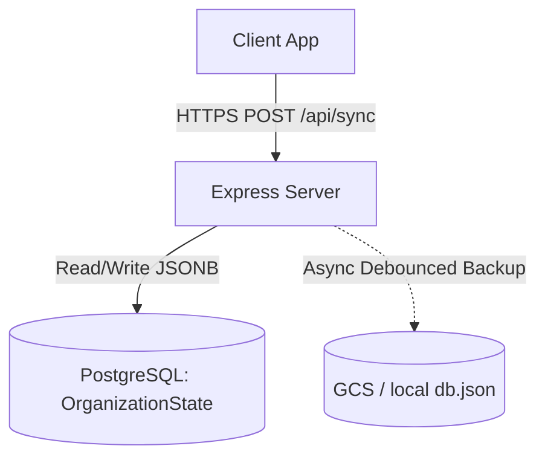
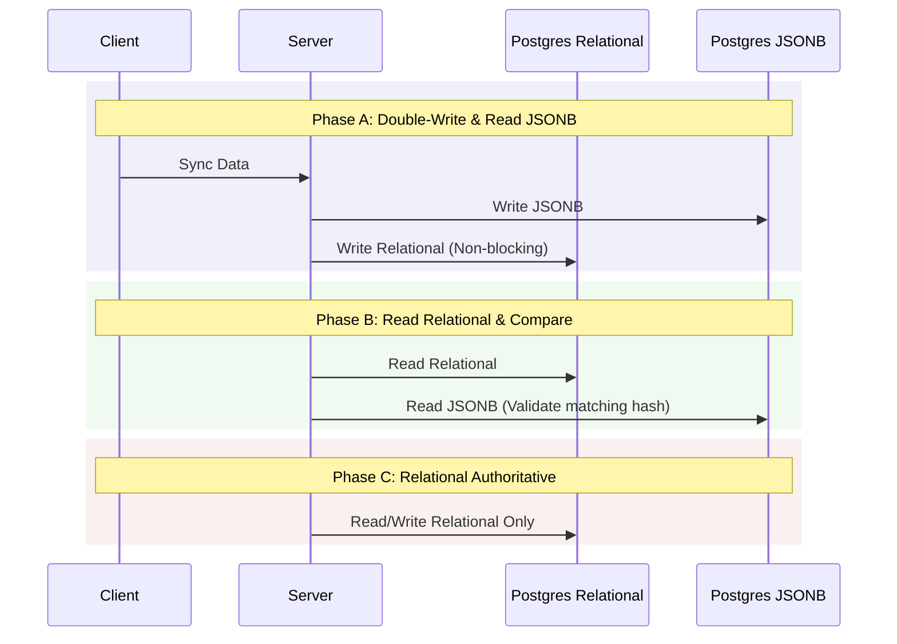

# VinOS Codebase & Architectural Improvement Plan

This document establishes a concrete technical roadmap to modernize the **VinOS** (formerly CellarFlow) platform. It covers data persistence, backend structure, security, sync mechanics, and premium UI completion.

---

## 1. Database Persistence Layer Modernization

### Current Architecture
Currently, VinOS operates on a hybrid storage model:
- **Core Entities** (Users, Organizations, Memberships, Invitations) are stored in normalized PostgreSQL tables.
- **Operational Data** (Lots, Vessels, Fermentation logs, Lab analyses, Sprays, Harvests, etc.) is serialized into a single monolithic JSONB column `data` in the `OrganizationState` table.
- A **GCS/Local JSON** backup runs in the background.



### Challenges & Risks
1. **Serialization Overhead**: Every `sync` read and write deserializes and serializes the entire organization state. As the winery's operations grow, this memory and CPU footprint will scale quadratically.
2. **Optimistic Lock Conflicts**: With multiple cellar workers syncing simultaneously, version conflicts (HTTP 409) will become frequent, forcing clients to retry and re-merge their local databases.
3. **No Database Indexes**: Querying sub-entities (e.g., fetching a specific Lot's history) requires loading the entire JSONB payload. SQL indexes cannot optimize queries.
4. **Relational Fragility**: Referential integrity checks (like checking if a fermentation log's `lotId` exists) are performed in JS/TS application code rather than at the database layer.

### Relational Migration Roadmap
The [schema.prisma](file:///d:/cellarflow/prisma/schema.prisma) file already contains definitions for detailed tables (e.g., `Vessel`, `WineLot`, `DailyFermLog`). We should transition these tables to become the authoritative source of truth.



#### Step 1: Establish Double-Writing (Safe Verification)
- Update [saveOrganizationData](file:///d:/cellarflow/server/db.ts#L1212) to write *both* to the JSONB `OrganizationState` and to the individual relational tables in a single transaction.
- Catch relational database errors but do not fail the request (keep the JSONB write authoritative). Log discrepancies.

#### Step 2: Implement Read Comparison (Shadow Reads)
- Implement shadow reads in [getOrganizationData](file:///d:/cellarflow/server/db.ts#L1195): fetch from both JSONB and normalized tables, compare structures, and log differences to telemetry.

#### Step 3: Shift Authority
- Deprecate `OrganizationState` database reads/writes.
- Switch the `/api/sync` engine to build response payloads by querying the normalized relational tables using Prisma joins.

---

## 2. Security & Zero-Trust Access Rules

The zero-trust principles defined in the [security_spec.md](file:///d:/cellarflow/security_spec.md) must be strictly enforced at the API border.

### Proposed Enhancements
1. **Centralized Scoping Middleware**: Replace inline capability verification in [server.ts](file:///d:/cellarflow/server.ts) with Express middleware that automatically extracts the organization context and validates ownership:
   ```typescript
   export function checkWineryScope(capability: Capability) {
     return async (req: Request, res: Response, next: NextFunction) => {
       const auth = await liveSessionRole(req);
       if (!auth) return res.status(401).json({ error: 'Unauthorized' });
       
       const activeOrgId = req.headers['x-cellarflow-org-id'] || auth.activeOrganizationId;
       if (!activeOrgId) return res.status(403).json({ error: 'Missing organization context' });
       
       // Verify membership
       const membership = getDB().memberships.find(
         m => m.userId === auth.username && m.organizationId === activeOrgId
       );
       if (!membership || !can(membership.role, capability)) {
         return res.status(403).json({ error: 'Forbidden' });
       }
       
       req.orgContext = { id: activeOrgId, role: membership.role };
       next();
     };
   }
   ```
2. **PostgreSQL Row Level Security (RLS)**:
   - Apply tenant-isolation policies on PostgreSQL. Ensure all queries targeting operational tables automatically inject an `organization_id` filter.
3. **Privilege Escalation Gate**:
   - Explicitly deny non-owner roles from modifying membership records or changing the `role` field on their own user profiles.

---

## 3. Backend Architecture & Modularity

The [server.ts](file:///d:/cellarflow/server.ts) file is currently a **2,800+ line monolith**. This makes unit testing endpoints, tracking middleware flow, and reviewing Git histories highly complex.

### Monolith Deconstruction Plan
We will split `server.ts` into a modular package structure:

```text
server/
├── routes/
│   ├── auth.ts         # User registration, Login, OAuth, and Email verification
│   ├── sync.ts         # Client/server synchronization endpoint
│   ├── winemaker.ts    # Gemini AI integrations & sensory profile generation
│   ├── admin.ts        # Master admin godmode portals & system health diagnostics
│   └── telemetry.ts    # Simulated cellar floor telemetry streams
├── middleware/
│   ├── auth.ts         # Authentication guards, session verification, capabilities
│   └── rateLimiter.ts  # Shared brute-force login limiter
└── index.ts            # App initialization, express middlewares, and server bootup
```

#### Step-by-Step Refactoring
1. Move authentication endpoints (`/api/auth/*`) to `server/routes/auth.ts`.
2. Move sync endpoints (`/api/sync`, `/api/db`) to `server/routes/sync.ts`.
3. Extract admin routes (`/api/admin/*`) and secure them behind a master admin validation helper.
4. Update `server.ts` (renamed to `server/index.ts` or imported by a thin entry point) to mount these routers:
   ```typescript
   app.use('/api/auth', authRouter);
   app.use('/api/sync', syncRouter);
   app.use('/api/admin', adminRouter);
   ```

---

## 4. Sync Engine & Conflict Resolution

### Current Sync Model
The sync mechanism in [server/sync.ts](file:///d:/cellarflow/server/sync.ts) is document-oriented:
- Checks if the client's `baselineTimestamp` matches the server's `lastModified`.
- If they differ, the change is rejected, returning a full-document conflict to the client.
- Untouched properties fall back to last-write-wins at the document level.

### Sync Modernization Path
To support offline cellar operations across multiple tablets:
1. **Field-Level Diffing**:
   - Compare incoming properties property-by-property rather than record-by-record. If User A updates a vessel's `temperature` and User B updates its `cleaningStatus` offline, both changes should merge cleanly.
2. **Conflict-Free Replicated Data Types (CRDTs)**:
   - Transition state tracking on the client (RxDB) and server to LWW-Element-Set (Last-Write-Wins-Element-Set) or delta-state CRDTs.
3. **Structured Sync Payloads**:
   - Instead of sending entire lists of objects (lots, vessels) in the POST request, client requests should send only the delta changes (upserts and deletes) recorded in a local sync queue.

---

## 5. Premium UI/UX & PWA Performance

We will execute the remaining components of the **MaraniOS/VinOS Design Plan** ([docs/design-plan.md](file:///d:/cellarflow/docs/design-plan.md)) to create a premium visual experience:

### UI Refinements
- **Phase 3 (Domain Wow)**:
  - Add active liquid fill animations in [VesselFill.tsx](file:///d:/cellarflow/components/VesselFill.tsx) using dynamic SVG curves, showing secondary colors based on wine variety (e.g., deep burgundy for Saperavi, golden-yellow for Rkatsiteli).
  - Complete the interactive [QvevriCrossSection.tsx](file:///d:/cellarflow/components/QvevriCrossSection.tsx) to visually indicate yeast/lees sediment and temperature gradients.
- **Phase 4 (Micro-Interactions)**:
  - Introduce smooth layout transitions for tabs (e.g., switching between "Receiving" and "Fermentation") using Framer Motion's shared `layoutId` pills.
  - Implement spring-based micro-animations on interactive cards (e.g., hover lifts on tank grid).
- **Phase 5 (Performance Auditing)**:
  - Verify that animation FPS stays above 60fps under 4× CPU throttling (representing cheap cellar tablets).
  - Audit Service Worker ([sw.js](file:///d:/cellarflow/public/sw.js)) caching to pre-cache font files and brand assets, guaranteeing immediate offline shell boots.
