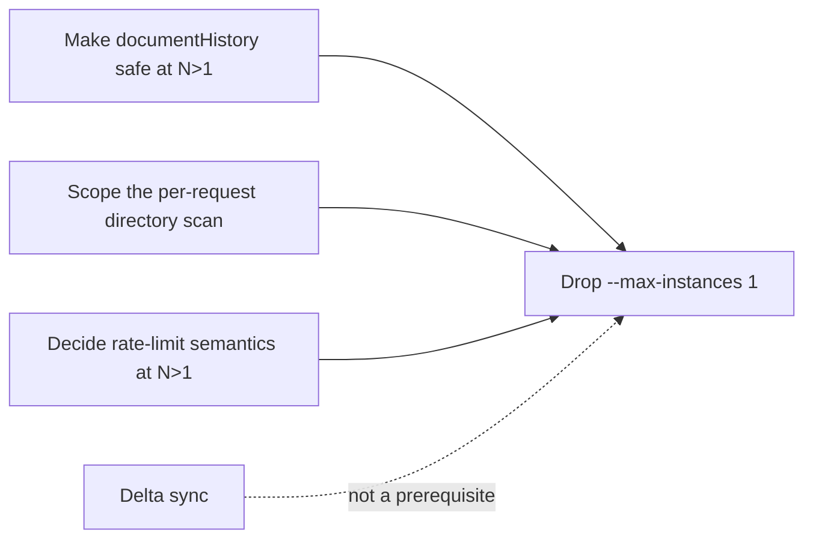

# Scale-out and delta sync — design pass

**Status date:** 2026-08-13
**Scope:** what actually prevents running more than one server instance, and what a per-record delta sync protocol would look like
**Deliverable:** a design and a revised sequence. No code changes accompany this document.

## 1. Why this document revises an earlier recommendation

The improvement assessment that led here proposed this order:

> move audit verification server-side → windowed hydration → **per-collection delta sync with cursors** → *then* drop `--max-instances 1`.

Steps 1 and 2 are done. Step 3 was framed as the prerequisite for horizontal scaling. **That framing was wrong, and this pass exists to correct it.**

Reading the write path showed that the hard part of multi-instance safety is already built:

- `saveOrganizationData` performs a real compare-and-set against PostgreSQL —
  `updateMany({ where: { organizationId, version: expectedVersion }, data: { version: { increment: 1 } } })`,
  raising `OrganizationStateVersionConflictError` when the row moved underneath it
  (server/db.ts:1850). `/api/sync` wraps this in a bounded three-attempt
  reload-merge-retry loop (server/routes/sync.ts:3030). Two instances writing
  the same organization concurrently is already correct: one wins, the other
  reloads and re-merges.
- Authorization already reads through to PostgreSQL on **every** request.
  `liveSessionRole` calls `refreshCoreMetadataFromPostgres()` before resolving
  the user, account status, approval, session version, and membership role
  (`server/middleware/auth.ts:59`). A role revoked on instance A is enforced by
  instance B on the next request.
- Command idempotency is keyed in PostgreSQL by `commandId`
  (`server/idempotentCommands.ts`), not in process memory.

Delta sync is a **payload-size and latency** project. Scale-out is a **shared-state**
project. They are close to independent, and the second is much closer to done
than the first. Sequencing scale-out behind a sync rewrite would delay the
redundancy and zero-downtime deploys by the length of the riskiest refactor in
the codebase, for no technical reason.



## 2. What actually breaks at more than one instance

Every module-level mutable structure in `server/` was enumerated and classified.
Only one is correctness-relevant.

| State | Location | Effect at N>1 | Severity |
|---|---|---|---|
| `documentHistory` | `server/sync.ts:109` | Field-level 3-way merges silently become reported conflicts | **Blocker** |
| Core directory cache | `server/db.ts` via `getDB()` | None for correctness — refreshed per request — but the refresh is O(platform) | **Blocker (cost)** |
| `requestCeiling` windows | `server/middleware/requestCeiling.ts:43` | Effective ceilings become N× more permissive | Decision needed |
| Telemetry rate-limit windows | `server/routes/telemetry.ts:46,49,51` | Same | Decision needed |
| `adminActions` | `server/routes/admin.ts:65` | Admin action list splits across instances | Degraded |
| Operational telemetry samples | `server/operationalTelemetry.ts:42-44` | Metrics sampled per instance; aggregates undercount | Degraded |
| `auditChainCache` | `server/auditChainCache.ts:34` | Safe — keyed by state version, a stale key re-verifies | None |
| `exchangeRates` / `wineAgencyRegistry` caches | respective modules | Duplicated upstream fetches | None |
| `local*` fallback stores | `aiKnowledge`, `aiNotificationOutbox`, `taskNotificationStore`, … | Only used when PostgreSQL is absent; production configures it | None (verify) |

### 2.1 The one real blocker: `documentHistory`

`mergeCollections` implements three-way merge. When a client's `baselineTimestamp`
does not match the server's `lastModified`, it looks up the baseline copy to
decide whether the two edits touched different fields:

```
const historyList = documentHistory.get(historyKey) || [];
const baselineEntry = historyList.find(entry => entry.lastModified === baselineTimestamp);
```
— `server/sync.ts:186`

The map is process memory. At N>1 the client's follow-up request may land on an
instance that never saw the baseline, so `baselineEntry` is `undefined`, the
field-level merge is skipped, and the edit is reported as a conflict instead.

Two properties of that failure matter:

- **It fails safe.** The conflicting edit is not applied and not lost; it is
  surfaced for resolution. There is no data-loss path here.
- **It fails nondeterministically.** Whether two people editing different fields
  of the same lot get a silent merge or a conflict modal depends on which
  instance served them. That is a bad property to ship: it makes a
  user-visible behaviour depend on load balancing, and it will be reported as
  "the app randomly complains about conflicts".

There is also a defect visible today, independent of scale-out: `documentHistory`
grows without bound. Entries are capped at 20 *per record key*, but keys are
never evicted — no TTL, no per-organization cleanup, no removal when a record is
deleted. A long-lived instance accumulates a baseline copy of every record ever
merged.

**Bounded 2026-08-13 (Phase C, part 1).** A TTL sweep plus a 20,000-record cap
now prunes the map, with `documentHistoryStats()` exposing its size
(`server/sync.ts`, `tests/documentHistoryBounds.test.ts`). This part of C does
not depend on the persist-versus-delete decision below: if the baselines are
later persisted the retention rule moves to the table, and if three-way merge is
deleted the map goes with it. Either way the leak is closed now rather than left
running while the decision waits on data.

### 2.1.2 What the deployment already tells us

Two structural facts, derivable without production traffic, that constrain the
decision more than they first appear:

1. **The service has no `--min-instances`** (`.github/workflows/google-cloud-run.yml`),
   so Cloud Run scales it to zero when idle. Every idle period and every deploy
   discards `documentHistory` entirely. A baseline only exists if the edit that
   superseded it was merged **in the same process lifetime**, so three-way merge
   works within a warm window and never across one.
2. **At N instances, both syncs must also land on the same instance.** With
   requests spread by the load balancer that is roughly a 1-in-N chance, so
   scaling to four instances would cut field-merge success to about a quarter of
   whatever it is today — on top of the cold-start losses above.

Note what this does *not* settle. Concurrent editing of one record is exactly the
situation that happens inside a warm window — two cellar workers on the same lot,
minutes apart — so the merge may still earn its keep despite both facts. The
structure narrows the answer; it does not supply it. The measured
`fieldMergeSuccessRate` still decides.

It is also worth recording the symmetry: the cold start that hides the memory
leak is the same event that erases the feature's state. Fixing the leak (above)
removes the reason to tolerate the cold start as a mitigation.

**Options, in order of preference:**

1. **Persist baselines.** A `RecordBaseline` table keyed
   `(organizationId, collection, recordId, lastModified)` holding the JSON, with
   a retention window (say 7 days) and deletion on tombstone. Turns a leak into
   a bounded table and makes the merge deterministic across instances. Cost: one
   extra read on the conflict path only — the clean fast-forward path never
   touches it.
2. **Derive the baseline instead of storing it.** The org state row is versioned;
   with a modest `OrganizationStateHistory` of recent versions the baseline could
   be recovered by looking up the version whose record `lastModified` matches.
   Heavier read, no new write path, and it composes with delta sync (§4).
3. **Drop three-way merge.** Honest but a real regression: every
   stale-baseline edit becomes a conflict, including the common
   "two people edited different fields" case that the merge exists to absorb.
   Only worth considering if measurement shows the merge rarely succeeds.

Recommend **(1)**, but measure first. **Do not build (1) before the number
exists** — if field merges rarely succeed, (3) is defensible and deletes code
instead of adding a table.

### 2.1.1 Phase A — the instrument (implemented 2026-08-13)

`mergeCollections` now accepts an optional `MergeOutcomeTally` and classifies
every record it merges (`server/sync.ts`). The tally travels on
`SyncCandidateResult` and is recorded once per request — on the conflict
response and after a successful save, never on an attempt the
optimistic-concurrency loop discarded.

Read it at `GET /api/admin/operational-metrics` under `syncMergeOutcomes`, or
from the structured `cellarflow_operational_metric` lines in the service log.
Counts only: no ids, collections, field names, or tenant data.

| Field | Meaning |
|---|---|
| `staleBaseline` | Records that exercised three-way merge at all |
| `fieldMergeSuccessRate` | Share of those the merge resolved silently — what it buys |
| `baselineUnavailableRate` | Share it could not judge for want of in-process history |
| `unavoidableConflictRate` | Share where both sides edited one field — conflicts no strategy avoids |
| `redundantRecordRate` | Share of merged records the client did not need to send (§4.1) |

**Decision rule, fixed in advance so the result is not rationalised afterwards:**

- `fieldMergeSuccessRate` **low** (merge rarely rescues anything) → take **(3)**,
  delete three-way merge and the `documentHistory` map with it. Scale-out is then
  unblocked by a deletion.
- `fieldMergeSuccessRate` **high** and `baselineUnavailableRate` **low** → the
  merge is doing real work on a single instance and would stop doing it at N>1.
  Take **(1)** and persist the baselines.
- Both **high** → the merge is valuable but already unreliable. Persist the
  baselines and expect the success rate to rise once history stops being lost to
  restarts and the 20-entry cap.

`redundantRecordRate` is collected by the same instrument and informs §4
independently: it is the fraction of each payload per-record deltas would remove.

Sampling is bounded to the last 500 syncs that merged anything, and syncs
containing only new records are deliberately not sampled — they carry no signal
for either question and would dilute the window.

### 2.2 The cost blocker: a platform-wide scan on every request

`refreshCoreMetadataFromPostgres()` runs on every authenticated request and does:

```
prisma.user.findMany(), prisma.organization.findMany(),
prisma.membership.findMany(), prisma.invitation.findMany()
```
— server/db.ts:1074

Unfiltered. Every request loads every user, organization, membership, and
invitation on the platform, then rebuilds the in-process directory.

This is correct and it is why authorization is already multi-instance safe. It is
also O(total tenants) per request. At today's tenant count it is invisible. At
100 wineries × 10 users it is ~1,000 user rows plus memberships on every request
to every endpoint — and on a single instance, that cost is serialized through one
event loop.

**Resolved 2026-08-13 (Phase B).** `liveSessionRole` now calls
`loadSessionPrincipal(username)` — one keyed `user.findUnique` with its
memberships included — instead of rebuilding the directory
(`server/db.ts`, `server/middleware/auth.ts`). Per authenticated request the
database work goes from four unfiltered `findMany` scans to a single indexed
read, and no longer grows with the number of tenants on the platform.

Freshness is unchanged: `accountEnabled`, `approvalStatus`, `sessionVersion`,
and the membership role are still read from PostgreSQL on **every** request, so
withdrawn approval and role changes still take effect on the next call. Only the
scope of the read changed. The keyed rows are written back into the process
directory so same-user reads elsewhere stay current, and every route that
enumerates *other* users — all 21 admin handlers, all 21 auth handlers, and the
task-notification lookup — already called `refreshCoreMetadataFromPostgres()`
itself, so none of them depended on the request path as their source of
freshness. When PostgreSQL is unreachable the in-memory directory answers
exactly as before.

The security decisions are covered against the keyed branch in
`tests/sessionPrincipal.test.ts`; the pre-existing revocation tests run without
PostgreSQL and therefore only exercise the fallback.

The rest of this section records the original finding.

**This was a more urgent scaling threat than sync payload size,** and it was
cheaper to fix. The per-request path needs exactly one user, their memberships,
and the active organization — a keyed query, not a table scan.

The care required: `getDB()` is a process-wide directory that ~13 modules read,
and the admin portal legitimately needs the full listing. The fix is to split the
two uses — a narrow `loadSessionPrincipal(username)` for the request path,
retaining the full refresh for admin routes that genuinely enumerate — not to
delete the cache.

### 2.3 Rate limiting is a decision, not a bug

`requestCeiling` already documents that its window is per instance and in memory,
and argues the cross-instance guarantee matters for credential brute force (which
`createSharedLoginLimiter` handles) more than for throttling an authenticated
caller. That reasoning holds at N>1: ceilings become N× more permissive, and they
are runaway guards rather than quotas.

What is needed is a decision recorded before scale-out, not necessarily a change:
either accept N× and set the per-instance number accordingly, or move the counter
to PostgreSQL/Redis. Accepting is defensible; discovering it accidentally is not.

### 2.3.1 Phase D — the decision (2026-08-13)

An audit of every limiter in the service found the decision surface is narrower
than assumed. The limits that must hold globally are **already shared**:

| Limiter | Backend | Behaviour at N>1 |
|---|---|---|
| Login, account recovery, invitation, registration approval, OAuth callback, task notification | PostgreSQL `loginAttempt` via `createSharedLoginLimiter` | **Correct** — one global counter |
| `requestCeiling` (sync/state 120·min⁻¹, commands 120·min⁻¹, audit trail 240·min⁻¹) | In-memory, per instance | N× more permissive |
| Telemetry client-error (5), CSP report (20), performance (12) per IP·min⁻¹ | In-memory, per instance | N× more permissive |

**Decision: accept N× for the per-instance guards. Do not move them to shared
storage, and do not divide the ceiling by the instance count.**

Reasons, in order of weight:

1. **Nothing security-critical depends on them.** Credential brute force,
   account recovery, invitation and OAuth abuse are all on the PostgreSQL-backed
   limiter already. `requestCeiling` guards against a client stuck in a retry
   loop; the telemetry throttles guard public endpoints whose stored output is
   separately bounded (100 client errors, 500 telemetry samples).
2. **Dividing would be actively harmful.** HTTP keep-alive keeps a client's
   requests on one connection, so a caller can legitimately send its whole burst
   to a single instance. A ceiling of `max / N` would refuse real work while the
   global budget sat unused — trading a theoretical over-permit for a real
   outage.
3. **N × a number already set well above legitimate use is still bounded** and
   still far below the load that motivated the guard.

The consequence is explicit: **raising `--max-instances` raises the effective
global ceiling proportionally, and that is intended.** If a limit ever has to
hold globally, it belongs in `createSharedLoginLimiter`, not in `requestCeiling`.
This is now stated in the middleware's own docblock so the next reader does not
have to re-derive it.

### 2.3.2 A weakness found while auditing (fixed)

Both `requestCeiling` and the three telemetry throttles bounded their tracking
map by calling `clear()` on reaching the cap — discarding **every** tracked
caller's counter at once. A throttled client therefore got a fresh allowance as
soon as enough unrelated callers arrived, so the ceiling was weakest exactly when
the service was busiest. Reaching that state required no privilege: keep arriving
as new callers.

This was not a scale-out problem — it was equally true on one instance — but the
audit is what surfaced it. Both now sweep expired windows first and, if
everything tracked is still live, evict the entry with the **lowest count**.

The eviction order is the subtle part, and the first fix got it wrong: evicting
the *oldest* entry is intuitive and backwards, because the longest-tracked caller
is usually the one being throttled, so eviction rebuilt the very hole being
closed. A caller below its limit loses nothing by being forgotten; a caller at
its limit is the only reason the map exists. `tests/requestCeiling.test.ts` pins
the behaviour and fails against the old `clear()`.

### 2.4 The GCS backup mirror is a fourth blocker

Found 2026-08-13, after the first draft of this document, and it also answers
open question 1 in §6.

`.env.example` states the constraint plainly beside the setting itself:

> Keep Cloud Run max instances at 1 while using this single-object db.json backend.

When `GCS_BUCKET` is set — and the deployment workflow sets it — `saveDB` mirrors
the **entire** `db.json`, every organization in the process, to a **single**
object, debounced by `GCS_BACKUP_MIN_INTERVAL_MS` (90s). Each instance holds only
the organizations it has hydrated or touched, so with N instances a later upload
from an instance with a narrower view overwrites a more complete snapshot.

PostgreSQL is authoritative, so this is not user-visible data loss. It is worse
in one specific way: the backup silently degrades while continuing to look
healthy, and a backup is only discovered to be wrong when it is needed. The
recovery runbook's checksum comparison would be verifying a file that no single
instance ever owned.

**So `--max-instances 1` is partly load-bearing outside the code**, which the
rest of this plan assumed it was not. Phase E must therefore also either:

- **retire the mirror** — PostgreSQL has been authoritative since the JSONB
  cutover, Cloud SQL has backup/PITR, and this object is a second, weaker copy
  of the same data on a different retention policy; or
- **make it instance-safe** — write per-instance objects, or elect a single
  writer, and reconcile on restore.

Retiring it is the stronger option and removes code rather than adding it, but it
touches the documented recovery path, so it belongs to the recovery runbook owner
rather than to this plan.

## 3. What scale-out then requires

With §2.1 and §2.2 resolved, `--max-instances 1` can be raised. The remaining
work is operational rather than architectural:

- Confirm the JSON store is genuinely unreachable in production
  (`initDB` already refuses fallback storage when `DATABASE_URL` is set and
  PostgreSQL is unreachable — verified locally: the server refuses to boot).
- Cloud SQL connection limits: N instances × pool size must stay within the
  instance's `max_connections`.
- The scheduled jobs (billing renewals, AI monitoring) must not multiply. They
  run as Cloud Run Jobs, not in the service, so this is a check rather than work.
- Sticky sessions are **not** required and should not be enabled — relying on
  them would mask §2.1 rather than fix it.

## 4. Delta sync design

Independent of the above, and still worth doing: it is the difference between a
sync costing what *changed* and one costing what *exists*.

### 4.1 The current unit is a whole collection

```
payload[this.serverCollectionKey(clientKey)] = currentState[clientKey];
```
— lib/syncQueue.ts:922

Dirty tracking is per collection (`getDirtyCollections`). Editing one fermentation
log marks `fermLogs` dirty and ships **every** ferm log the winery has. The server
then merges the entire array record by record, almost all of which are unchanged
(`sameContent` short-circuits them, but they still crossed the wire and were
parsed and compared).

A second full-state transfer hides in the offline path: when queued mutations
exist, the client issues `GET /api/db` purely to pre-check conflicts before
posting (`lib/syncQueue.ts:950`).

### 4.2 The cursor already exists

`setOrganizationStateHeaders` puts the organization's monotonic state version on
every response as `X-CellarFlow-Org-State-Version`, and the client stores it via
`rememberOrgStateHeaders` (`server/middleware/auth.ts:117`, `lib/syncQueue.ts:622`).
That is the cursor primitive. Delta sync does not need a new one invented — it
needs the version to gate *what is returned*, not merely to be reported.

### 4.3 Proposed protocol

**Upstream (client → server): per-record, not per-collection.**
Track dirty *record ids* alongside dirty collections and send only those records.
The server merge already operates per record and merges additively — records
absent from a payload are untouched, deletion happens only through explicit
tombstones (`server/sync.ts:155`, proven by
tests/auditHydration.test.ts:125). **No server merge change is required for the
upstream half.** This is a client-side change plus a payload-limit revision, and
it is the cheaper, lower-risk half.

**Downstream (server → client): records changed since the client's version.**
This is the harder half, because the authoritative store is one JSONB document
with no per-record change index. Options:

- **(a) Per-record `lastModified` filter.** The server holds the full state
  anyway; return only records whose `lastModified` is newer than the client's
  last sync timestamp. Cheap to implement, no schema change, and it shrinks the
  response. It does not shrink the server's own read (still one whole JSONB
  document) and relies on `lastModified` being trustworthy on every record.
- **(b) A change-log table.** Append `(organizationId, version, collection,
  recordId, op)` per mutation. The cursor becomes exact, tombstones fall out
  naturally, and it composes with §2.1 option (2). Real schema and write-path
  work.
- **(c) Wait for the relational projection.** `server/relationalProjection.ts`
  already maintains a tenant-safe vessel/lot projection beside the JSONB. If
  relational storage becomes authoritative, per-record queries and cursors are
  native and this whole problem dissolves.

**Recommendation: (a) now, (c) as the real answer, (b) only if (c) stalls.**
Option (a) is a meaningful win for a few days' work and does not foreclose
anything. Option (b) risks building a change-log that (c) makes redundant.

### 4.4 What must not break

These are contracts, each already covered by tests, and the reason this refactor
is feasible at all:

- Per-record optimistic concurrency via `baselineTimestamp`; a stale untouched
  copy losing to a newer server version is **not** a conflict (server/sync.ts:4-13).
- A multi-collection payload is one client transaction — a conflict in any record
  defers the whole payload rather than persisting clean siblings
  (server/routes/sync.ts:2718).
- Collection-aware tombstones, the deletion ledger, and recreated-identity
  handling.
- Audit immutability and server-side re-signing on merge.
- Ordered payload ceilings: the body-byte ceiling binds before record ceilings,
  with the inline-attachment budget reachable beneath it.

**Regression surface:** ~136 sync-related tests across nine files, including the
deterministic two-client matrix (`tests/twoClientSyncMatrix.test.ts`) covering
edit/edit, edit/delete, delete/edit, delete/delete, role-change-after-session,
partial connectivity, and lost-response retry. Any delta protocol must keep every
one of these green **without modification** — a change that requires editing the
two-client matrix is changing a behavioural contract, and that needs saying out
loud rather than absorbing into a diff.

## 5. Recommended sequence

| Phase | Work | Unblocks | Risk |
|---|---|---|---|
| **A** | ~~Instrument field-merge success vs. conflict rate~~ **done 2026-08-13** | The §2.1 decision — now awaiting production traffic | None |
| **B** | ~~Scope the per-request directory scan to one principal~~ **done 2026-08-13** | Real per-request cost | Lower than expected: every enumerating route already refreshed itself |
| **C1** | ~~Bound the `documentHistory` leak~~ **done 2026-08-13** | A live memory leak, independent of the fork | Low |
| **C2** | Make `documentHistory` durable, or delete 3-way merge on A's evidence | N>1 correctness | Medium — **still blocked on A** |
| **D** | ~~Record the rate-limit decision; adjust ceilings~~ **done 2026-08-13** | N>1 semantics | Low — decision was to accept N×; no ceiling changed |
| **E** | Raise `--max-instances`, verify pools and jobs | Redundancy, zero-downtime deploys | Operational |
| **F** | Upstream per-record deltas (client-side) | Upload size | Low — server merge unchanged |
| **G** | Downstream `lastModified` filtering | Download size | Medium |

A–E deliver redundancy and zero-downtime deploys. F–G deliver the payload win.
Neither half blocks the other.

## 6. Open questions for the owner

1. ~~**Is `--max-instances 1` load-bearing for anything not in this document?**~~
   **Partly answered 2026-08-13:** yes — the single-object GCS `db.json` mirror
   requires it, and `.env.example` says so beside the setting (§2.4). Still worth
   confirming there is no *further* external reason: a licence, a Cloud SQL
   connection cap, or a cost ceiling.
2. **Is the relational cutover (§4.3c) still the intended destination?** The
   answer changes whether the downstream delta is a stopgap or a permanent
   protocol.
3. **What conflict rate is acceptable** if measurement supports deleting
   three-way merge instead of persisting baselines?
